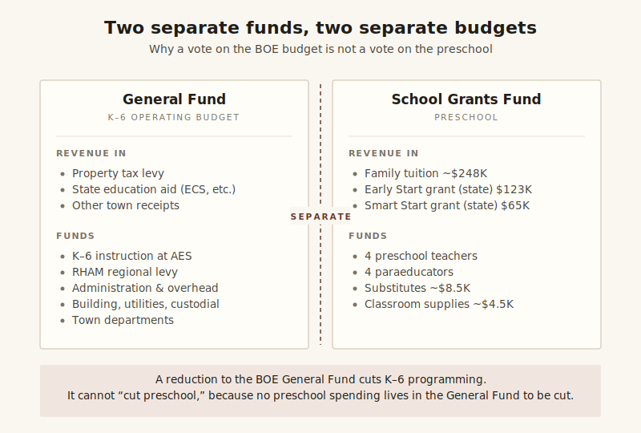
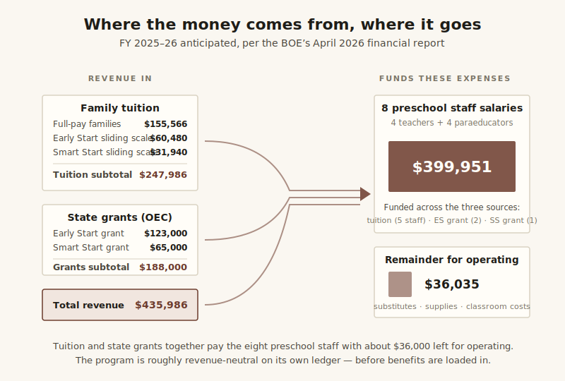
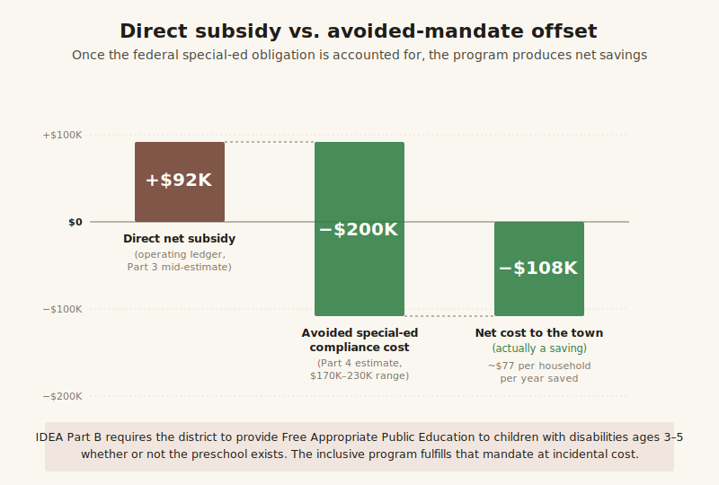

Andover Elementary School Preschool — Financial Analysis
========================================================

*A personal report by Scott Sauyet · scott@sauyet.com · Not an official town
document*

*Report compiled May 2, 2026, with significant updates May 10, 2026, and a
further-research refinement on June 6, 2026, for use in town deliberations on
the financial role of the Andover Elementary School preschool program. This
report has three layers. The original analysis (Parts 1–6) is built from public
records: the FY 2024–25 Andover audit (filed with the Connecticut Office of
Policy and Management on EARS, document ID 13598), the Connecticut Comptroller's
OpenCheckbook for the same fiscal year, the Andover Board of Education's monthly
meeting packets (specifically the financial report dated April 8, 2026), the AEA
Contract 2025–2029, the CSEA Contract 2024–2028, and the school's published
"About Pre-K" page and 2025–26 Preschool Registration Packet. A May 9, 2026
update from Superintendent Dr. Valerie Bruneau — sitting in front of the
original analysis and quoted with permission — confirms several figures,
supplies actuals where the original relied on estimates, and clarifies a
structural point about how preschool is funded that materially changes the
headline conclusion. A third layer, added June 6, 2026, refines the legal basis
of the privacy discussion in § 4 of that Update in light of further research,
without changing its conclusion. Inline callouts in each affected section
cross-reference the relevant layer. All figures are presented as found;
methodology, caveats, and known data gaps are described below.*

---

Update from the Superintendent's Office (May 9, 2026)
-----------------------------------------------------

This Update sits in front of the original report at Dr. Bruneau's invitation to
"lay out, even at a high level, what the preschool's expenses are and what funds
them" — the very question the original report was designed to surface. On the
evening of May 9, 2026, the author emailed Dr. Bruneau with a short list of
questions and a link to the original report. Her response, sent later the same
evening, is reproduced and discussed below with her permission. The Update has
six parts: a structural finding about how preschool is funded, confirmation of
actual figures, a statement that the four-classroom program is not at risk in
the budget vote, a substantive methodology update on the FERPA and HIPAA
constraints that limit aggregate benefits disclosure in a small program,
additional context on out-of-town enrollment, and a follow-up analysis using
publicly available sources that explains why the Smart Start grant has stayed at
$65,000 since 2017 — answering one of the open questions the original report
flagged.

### 1. Preschool is not in the BOE general fund ###

The single most consequential clarification is structural. From Dr. Bruneau's
email:

> "Preschool is not funded through the town's general fund, so even if the AES
> budget is reduced, there is no preschool line item there to cut. The eight
> preschool staff salaries are funded through tuition and grants and would not
> be affected. … Any reductions to the AES general fund budget would directly
> impact kindergarten through sixth grade programming. … If people are saying
> that a budget cut would force preschool reductions, that simply is not
> accurate. I can't cut what does not exist in the general fund."

<figure class="diagram"> 
<figcaption><strong>Figure 1.</strong> The two funds, side by side. The BOE
budget vote affects the General Fund (left). Preschool spending lives entirely
in the School Grants Fund (right) and is paid out of tuition and Office of Early
Childhood grants — so a reduction to the General Fund cannot reach
it.</figcaption> </figure>

This reframes a category of arguments heard around the budget. The eight
preschool staff are paid through the School Grants Fund — a separate fund
populated by tuition revenue and Office of Early Childhood grants, accounted for
separately from the General Fund that holds K–6 instructional spending. The
original analysis treated this as a fund-accounting detail; in town discussion
it has been treated as if "the BOE budget" and "the preschool budget" were the
same pool, which they are not. A vote to reduce the AES general fund does not
reduce preschool, because no preschool spending lives in that fund to be
reduced. The arithmetic constraint runs the other way: preschool expenses match
preschool revenues in their own fund, and reductions to the General Fund would
land on K–6 programming.

This shifts how the original report's "net town subsidy" figure should be read.
The estimate of approximately $92,000 per year is a fully-loaded allocation that
adds employee benefits — which the BOE charges to district-wide General Fund
accounts — to the program. It is not a preschool-specific line item that could
be eliminated by changing the preschool's structure. To the extent the town
wants to identify "what the preschool costs the General Fund," that figure is
benefits-only and runs through district-wide accounts that are not
preschool-segregated and not straightforwardly reducible without affecting other
programs. Even that figure, as the FERPA/HIPAA discussion below explains, the
town's accounting cannot make any more granular than it already is without
disclosure risk.

### 2. Confirmed actuals replace several estimates ###

Dr. Bruneau confirmed several figures the original report estimated, and her
overall assessment is that the original estimates ran *high* rather than low:

> "I can tell you spent a great deal of time carefully using public information,
> and overall it is accurate. If anything, your estimates were conservative. You
> actually overestimated the costs of salaries and insurance. … two of our
> preschool teachers are newer staff members, so their salaries are actually
> lower than what was estimated. Assuming the same staffing assignments next
> year, preschool teacher salaries will total approximately $297,000, and
> paraprofessional salaries approximately $118,000 — to be covered through
> anticipated tuition and grant funding. We are definitely still going to
> receive the Smart Start and Early Start grant funding at equal or higher
> amounts."

The numerical comparison:

| Item                                                  | Original report estimate                | Superintendent's confirmed FY 2025–26 actual           |
| ----------------------------------------------------- | --------------------------------------- | ------------------------------------------------------ |
| Teacher salaries (4 teachers)                         | ~$265,000 (mid-step) / $399,951 BOE total split implied higher | ~$297,000                                  |
| Paraeducator wages (4 paras)                          | ~$109,000 (mid-step) / $399,951 BOE total split implied higher | ~$118,000                                  |
| Combined staff compensation                           | $399,951 (BOE total)                    | ~$415,000                                              |
| Smart Start grant (FY 2025–26)                        | $65,000 anticipated                     | confirmed at equal or higher level                     |
| Early Start grant (FY 2025–26)                        | $123,000 anticipated                    | confirmed at equal or higher level                     |
| Benefits, program-allocated                           | ~$115,000 estimated (mid scenario)      | not disclosable in aggregate (see § 4); actual is lower than estimated because not all staff take district insurance |

> **Notes:** The Superintendent's confirmed combined staff compensation figure
> of approximately $415,000 ($297,000 + $118,000) is approximately $15,000
> *higher* than the BOE packet's $399,951 anticipated salary figure. The two
> figures are not contradictory — the BOE packet's "anticipated salary expense"
> line and the Superintendent's "salaries totaling" figure may differ in scope
> (e.g., whether stipends, longevity, or partial-year pro-rations are included),
> and the Superintendent indicates the actual figure may sit slightly above the
> BOE packet's anticipated number. Either way, the original report's
> contract-schedule derivation of approximately $374,000 was conservative on the
> low side, and the BOE packet's $399,951 was conservative on the low side as
> well. On the benefits side, the Superintendent's note that many staff do not
> take district insurance means the original $115,000 mid-scenario benefits
> estimate likely overstated the actual figure. The original estimate range of
> $107,000–126,000 was anchored to a salary base of approximately $400,000 with
> assumed insurance utilization at typical levels; both anchors should be
> revised slightly downward in light of the Superintendent's confirmation. A
> precise actual is not separately reportable for the reasons explained in § 4.

The structural conclusion of the original report — that the program is
approximately revenue-neutral in fund accounting, with a fully-loaded
program-level cost slightly above program-level revenue — is unchanged. What
changes is the magnitude: the actual gap is somewhat narrower than the original
estimates suggested, in the direction of the program covering more of its
fully-loaded cost than the original mid-estimate of ~$92,000/year showed.

### 3. The four classrooms remain regardless of the budget vote ###

Dr. Bruneau also confirmed that the four-classroom complement is set by
enrollment need and is not a budget variable:

> "I'm not sure if you had a chance to watch my last video, but four preschool
> classrooms are needed based on the number of students and their needs. No
> matter what happens with the general fund budget in round two, those four
> classrooms will remain. … If staff were ever to be cut, again four classes
> would still exist next school year for preschool."

This is consistent with the structural picture in Part 4 of the original report:
federal Least Restrictive Environment rules under IDEA Part B specifically
prefer the integrated model Andover uses, and the number of classrooms is
determined in part by the enrollment of children with identified needs whom the
district is legally required to serve. The four-classroom complement is
therefore not a discretionary line that can be shrunk to save money in the
General Fund — it both lives in a different fund (per § 1) and is sized to
comply with mandates the district cannot decline.

### 4. On the FERPA and HIPAA constraints — why aggregate benefits data isn't always shareable in a small program ###

**➤ Update (June 6, 2026):** Further research refines the staff-side legal basis
described in this section. In brief, HIPAA most likely does not reach
benefit-cost figures the town holds as an employer (they are employment records,
which HIPAA's definitions exclude), so the operative protection on the staff
side is Connecticut's FOIA personnel-privacy exemption under the *Perkins* test,
not HIPAA § 164.504(f); and the small-cell number 20 is a student-reporting
convention, not a staff rule. The conclusion of this section — that an aggregate
program-level benefits figure cannot be responsibly published in a small program
— is unchanged. See the section "Further Research on the Privacy Constraints
(June 6, 2026)" above, and the separate report [*When Small Numbers Become
Names*](http://andoverct.info/reports/aes/data-privacy/).

The original report's Part 6 included a recommendation that the BOE publish an
estimated allocation of benefits to the preschool program, with the
parenthetical "(no individual data required)." That parenthetical was
methodologically wrong, in a way worth explaining carefully because the
distinction matters in any small program. From Dr. Bruneau's email:

> "Regarding benefits, I cannot share aggregate insurance information, even
> without names attached. In a small program like ours, where staff roles can be
> connected to specific student needs, even aggregate information could
> indirectly identify individuals, and I have a legal obligation to protect that
> information."

The legal framework she is referring to has two pieces, both with explicit
federal guidance.

**FERPA's "indirect identifier" doctrine.** Under FERPA, personally identifiable
information (PII) is not limited to direct identifiers like names. Federal
regulations at 34 CFR §99.3, and the U.S. Department of Education's published
guidance, define PII to include "other information that, alone or in
combination, is linked or linkable to a specific student that would allow a
reasonable person in the school community … to identify the student with
reasonable certainty." Department of Education guidance explicitly notes that
*aggregate* data with small cell sizes can constitute PII when "other
information that would make the student's identity easily traceable" exists in
the aggregated tabulations. The cited examples of indirect identifiers include
disability status, race, place of birth, and "other descriptors."

The mechanism is concrete on the student side. If a published preschool figure
shows, say, "N children in the program receive special-education services," and
a reader in the school community knows the four-classroom structure and can see
which classroom or grouping is served by particular staff, the reader may in
some cases be able to identify which students are in the count — which means the
published aggregate has effectively disclosed their disability status. The rough
threshold widely used in school-data publication (suppressing or generalizing
cells with fewer than 10 students) exists precisely because cell counts at small
numbers are vulnerable to this kind of working-back. Andover's preschool is
small enough that several plausible cross-tabulations would fall below that
threshold.

**HIPAA's "summary health information" rule.** A parallel constraint applies
under HIPAA, but on the staff side rather than the student side. Under 45 CFR
§164.504(f), an employer-sponsor of a group health plan may receive "summary
health information" — aggregate claims or expense data about plan participants —
only under specified conditions, and even then the rule expressly notes that
summary health information "does not constitute de-identified information
because there may be a reasonable basis to believe the information is
identifiable to the plan sponsor, especially if the number of participants in
the group health plan is small." Department of Health and Human Services
guidance on this provision echoes that the small-group case is precisely where
aggregate summaries remain potentially identifiable. Eight preschool staff is a
small group by any reasonable definition.

The mechanism is concrete on the staff side as well. If the preschool's
aggregate benefits figure shows, say, "the preschool's staff health insurance
cost is $X," and a reader knows roughly what plans the district offers and at
what tier, and can compare that figure against the same figure published the
year before or against a similarly small comparable group, the reader can in
some cases work back to who in the program is taking family-tier coverage versus
single, or who is taking no district coverage at all. With eight staff whose
roles observers in a small town can readily identify by classroom, that
working-back is more plausible than it would be in a 100-staff program — which
is why federal guidance treats small cell sizes as a privacy concern in their
own right.

**Why both frameworks apply jointly here.** In a larger program these two risks
would be more separable: FERPA on student data, HIPAA on staff data, managed
through different channels. In Andover's preschool the two collapse together
because *staff roles can be linked to specific student needs*. A SPED-trained
paraeducator assigned to a classroom serving children with IEPs is a staff fact
(relevant under HIPAA when their benefits utilization is exposed) and an
indirect identifier of those children's services and disability status (relevant
under FERPA when staffing-by-classroom is publicly known). This is the specific
concern Dr. Bruneau identifies in her email — "where staff roles can be
connected to specific student needs, even aggregate information could indirectly
identify individuals." The joint application is not double-counting; it's the
consequence of a small program in which one piece of aggregate data can do work
under both privacy frameworks simultaneously.

The combined effect is that "share an aggregate program-level benefits figure"
is not as cost-free a request as the original report's Part 6 implied. The
Superintendent's position is supported by federal guidance under both FERPA and
HIPAA, not just one. The original report's framing — that an aggregate benefits
figure "would not require disclosing individual names" and "would not violate
FERPA or HIPAA" — conflated *direct* identifiers (names, IDs) with the broader
category of *indirect* identifiers that small-cell aggregate data can supply.

**What this means for the report.** The revised position: an aggregate
program-level benefits figure for the preschool, on its own and in any form
granular enough to be analytically useful, is *not* something the district can
responsibly publish without further analysis of disclosure risk. The original
report's recommendation in Part 6 that the BOE publish "an estimated allocation
of employee benefits to the preschool program … even at the level of a
percentage applied to salaries" is correspondingly walked back: a
*district-level* benefits figure with a methodology note explaining how
preschool's share is calculated would serve essentially the same analytical
purpose without the indirect identifier risk that a program-level figure
carries. That alternative is described in § 5 below.

The corroborating federal guidance is cited in Sources under the new "FERPA and
HIPAA reference materials" subsection.

### 5. Out-of-town enrollment, with sharper context ###

Dr. Bruneau makes the same structural argument the original Part 5 made —
out-of-town tuition is incremental revenue, not a cost — but adds context about
how the preschool compares to other shared community resources, and a sharper
statement of the financial mechanism:

> "I find it interesting that this 'out of town expense' concern/accusation only
> seems to arise around preschool. Out-of-town residents use many town resources
> (the library, senior center, basketball, and pickleball programs) all at no
> charge or additional to them. In fact, in Monday's Board of Selectmen packet I
> see included a library report showing 586 out-of-town checkouts. … The
> difference with preschool is that out-of-town families actually pay tuition
> ($6,000 per student) to fill otherwise empty seats that aren't bringing in the
> additional revenue. That revenue helps keep all eight preschool salaries out
> of the general fund and reduces costs to taxpayers. The math truly works in
> the opposite direction of what some people are suggesting."

The comparison is worth surfacing because it lands the point that out-of-town
tuition is not just neutral but actively favorable: it pays toward the staff
costs that would otherwise sit somewhere on the town's ledger, and it does so
for seats that — under the resident-priority enrollment policy — would otherwise
be empty. The original Part 5 made the "incremental revenue" argument
structurally; her framing supplies the second half of it, which is that the
incremental revenue specifically *displaces* costs that would otherwise fall on
taxpayers. Combined with § 1 above, this means out-of-town tuition is a direct
contribution to the School Grants Fund's ability to cover preschool staff costs
without drawing on the General Fund.

### 6. After further analysis — why the Smart Start grant has stayed at $65,000 ###

This subsection is not based on the Superintendent's email. It is the author's
follow-up analysis using publicly available sources, addressing one of the open
questions flagged at the end of Part 3 and in Key Observations of the original
report: why has Andover's Smart Start grant remained at $65,000 every year since
2017, even as the program has expanded from one classroom to four? The answer
that emerges from public sources is that the static figure is mechanical, not
discretionary, and that the program structure itself has frozen.

**The arithmetic anchor.** Andover's $65,000 annual Smart Start grant equals
exactly 13 students × $5,000 per student — the per-student operating cap set in
statute. The 2017 award announcement listed Andover as receiving funding for one
classroom of 13 children, and that 13-seat allocation has carried forward
unchanged. Adding classrooms does not automatically expand the seat count,
because the seat count was tied to the original award rather than to subsequent
enrollment.

**The program horizon was statutory.** The original Smart Start statute (Public
Act 14-41, signed in 2014) explicitly set a 10-year operating window: *"For the
fiscal years ending June 30, 2015, to June 30, 2024, inclusive, the Office of
Early Childhood … shall design and administer the Connecticut Smart Start
competitive grant program."* The program was designed from the start as a finite
expansion vehicle, not an open-ended funding stream.

**Smart Start has effectively stopped accepting new applications.** According to
the Connecticut Office of Early Childhood's Smart Start provider resources page,
"To date, 25 school districts have received a Smart Start grant, with 23 current
grantees." The only meaningful expansion since the original cohort was a 2021
pandemic-response opportunity called "Smart Start for Recovery," funded for
three years through the federal American Rescue Plan Act and offered
specifically to existing grantees and districts identified to have unmet
preschool need. Ten districts received Smart Start for Recovery awards. The
general Smart Start program is not currently soliciting applications from new
districts.

**The funding focus shifted to Early Start CT.** Effective July 1, 2025,
Connecticut consolidated its School Readiness, Child Day Care Contracts, and
State Head Start Supplement Grant programs into a single program called Early
Start CT, administered by OEC. Early Start CT, not Smart Start, is the program
through which Connecticut now expands publicly funded preschool access. The 2025
legislative session also saw a much larger commitment to early childhood funding
through Senate Bill 1, which became law in June 2025 and creates an Early
Childhood Education Endowment drawing up to $300 million per year from state
surplus funds — intended to support an estimated 16,000 additional preschool and
infant toddler spaces by 2030. The funding trajectory is moving toward Early
Start CT and the new endowment, not toward expansion of Smart Start allocations.

**A specific Smart Start increase was proposed but did not pass in 2025.**
Senate Bill 6 of the 2025 legislative session would have raised the Smart Start
operating cap from $5,000 to $7,000 per student and from $75,000 to $105,000 per
classroom — the first proposed increase to those caps since the original 2014
statute. The bill passed the Senate on May 13, 2025 but died in the House at the
end of the session and did not become law. Smart Start operating caps therefore
remain at the original $5,000/$75,000 figures.

**What this means for the original report's question.** The original report
asked whether Andover might pursue additional Smart Start funding as the program
has expanded from one to four classrooms. Public sources suggest the answer is
that this is not currently a viable path, for two reasons: (a) the per-student
cap has not been increased, so additional funding would require additional seats
rather than higher per-seat amounts, and (b) the program is no longer accepting
applications for new seats from districts that are not already designated
grantees of an expansion round. The funding mechanism that would accommodate
Andover's classroom growth is Early Start CT — which Andover already
participates in, and which the Superintendent has confirmed is funded at "equal
or higher" levels going forward.

The Smart Start figure, in other words, is not static because anyone has
declined to ask for more; it is static because the program structure that would
deliver more has effectively closed to new requests, with funding attention
shifting elsewhere. The original report's framing in Key Observations, that "the
original 2017 award has continued unchanged … whether additional Smart Start
funding is available, whether application would be successful, and whether the
town has actively pursued expansion of its Smart Start allocation are questions
worth asking," is now answered to the extent public sources can answer it: the
funding is not currently available, an application would not currently be
successful, and pursuing expansion would in any case be the wrong vehicle —
Early Start CT is where Connecticut's preschool expansion funding now lives.

### What this means for the rest of the report ###

The original analysis (Parts 1–6) was built from public records and explicitly
invited the Superintendent's office to fill in the gaps. That invitation was
accepted, and the gaps were filled. The original analysis remains a useful
exposition of how the program looks from public records — the audit, the
Comptroller's payments, the BOE packets, the contracts — and the methodology
stands. Where the Update narrows or sharpens specific numbers or framings, an
inline callout in the affected section (formatted **➤ Update (May 10, 2026):**
…) points back to the relevant part of this Update section. None of the original
sections has been removed or rewritten; the Update layer sits in front of them
and the callouts cross-reference where the public-records picture and the
Superintendent-confirmed picture meet.

A reader who wants the headline answers can stop after reading this Update
section. A reader who wants to see how the original public-records analysis
produced the questions the Update answered should read on into Parts 1–6.

---

Further Research on the Privacy Constraints (June 6, 2026)
----------------------------------------------------------

After this report was published, the author developed the privacy question
raised in § 4 of the Update above into a separate, fuller analysis, [*When Small
Numbers Become Names*](http://andoverct.info/reports/aes/data-privacy/) (also
linked in Sources). That analysis confirms § 4's conclusion — that an aggregate
program-level benefits figure for a group as small as the preschool's eight
staff cannot be responsibly published — but it refines the legal basis on the
staff side in a way worth recording here. In short, § 4 reached the right
destination by what closer research shows is not quite the right road, and the
road matters: an argument that names the wrong statute is easy to wave away.

### On the staff side, the operative law is Connecticut's FOIA, not HIPAA ###

Section 4 grounded the staff-benefits constraint in HIPAA, citing 45 CFR
§164.504(f) and its rule that "summary health information" can remain
identifiable when the plan group is small. Closer research indicates that HIPAA
most likely does not reach these figures at all. A town is generally not a HIPAA
covered entity; its group health plan may be, but information the town holds in
its role as an employer — in payroll and budget records — is treated as
employment records, which HIPAA's own definitions expressly exclude from
protected health information (45 CFR §160.103). The benefit-cost figures sitting
in the town's budget are, in all likelihood, employment records outside HIPAA's
reach altogether. The §164.504(f) "summary health information" provision governs
what a group health plan may disclose to the plan sponsor; that is a different
thing from the cost figures already recorded in the town's own budget.

The protection that does apply on the staff side comes from Connecticut's
Freedom of Information Act, which exempts "personnel or medical files and
similar files the disclosure of which would constitute an invasion of personal
privacy" (Conn. Gen. Stat. §1-210(b)(2)), assessed under the two-part test in
*Perkins v. Freedom of Information Commission*, 228 Conn. 158 (1993). That
exemption is not automatic: the total cost of public employment is a legitimate
public concern, so an aggregate is disclosable, while what may be withheld is
detail fine enough to expose an individual's coverage tier, a decision to
decline coverage, or participation in the Medicare/veterans' HRA. The line falls
between the aggregate and the disaggregation, not at a statute's say-so about
"summary health information."

One related correction: there is no fixed minimum group size for staff. The
small-cell threshold of 20 used elsewhere in Connecticut is a
*student*-reporting convention under FERPA and the state's ESSA plan, not a
HIPAA rule; HIPAA's own method for de-identifying data sets no group-size number
at all. The small-group intuition in § 4 is sound, but the specific number does
not come from the staff-side law.

### On the student side, the analysis stands and is sharpened ###

The FERPA reasoning in § 4 is unchanged, and the separate report strengthens it
by adding the Individuals with Disabilities Education Act (the IDEA) as a second
layer and by giving the clearest single example: the dedicated one-on-one
paraprofessional. Such an aide exists because one particular child's IEP
requires it, so disclosing aide-level staffing detail discloses, by inference,
that identifiable children carry IEPs significant enough to require dedicated
support — information protected under both FERPA and the IDEA. This is the
sharpest form of the "staff roles can be linked to specific student needs" point
that § 4 already made.

### What does not change ###

The bottom line of § 4 is intact. An aggregate program-level benefits figure for
the preschool cannot be responsibly published in any form granular enough to be
analytically useful, and the disclosure-safe alternative remains a
*district*-level figure (or an all-staff aggregate) with a methodology note —
the kind of number already carried in the budget. The refinement is to the
route, not the destination: the staff-side protection is best grounded in
Connecticut's personnel-privacy law rather than in HIPAA, and "HIPAA" is the
everyday shorthand for what is, more precisely, a Connecticut FOIA matter on the
staff side and a FERPA-and-IDEA matter on the student side. The full analysis,
with citations, is in [*When Small Numbers Become
Names*](http://andoverct.info/reports/aes/data-privacy/).

---

Why this report exists
----------------------

The Andover Elementary School preschool program has been the subject of
recurring discussion in town budget conversations, focused on two questions:
what does the program actually cost the town, and to what extent does it serve
out-of-town families. Both questions have answers that can be assembled from
public sources — the town's annual audit, the Connecticut Comptroller's payment
records, the Board of Education's monthly meeting packets, the published
collective bargaining agreements, and the school's own enrollment policies — but
assembling the answer takes some work. This report does that work and presents
what is determinable. A closing section observes how the existing monthly
reporting could be consolidated and contextualized to make the same information
available without requiring residents to assemble it themselves.

**➤ Update (May 10, 2026):** A subsequent email exchange with the Superintendent
addressed several of the open questions in the original analysis directly. See
the Update section above for the consolidated findings; inline callouts
throughout Parts 1–6 cross-reference the relevant items.

The short version of the answer to the first question: the program is
approximately revenue-neutral on an operating basis and runs a small net subsidy
when employee benefits are fully loaded. The Board of Education's own April 2026
financial report shows FY 2025–26 anticipated revenue of $435,986 (tuition plus
state grants) against $399,951 in anticipated staff salaries, leaving roughly
$36,000 to cover substitutes, supplies, and other classroom costs. Once an
estimated allocation of employee benefits is added — the figure the BOE report
does not break out at the program level — the fully-loaded marginal cost rises
to approximately $520,000–539,000 and produces a net town subsidy in the range
of $84,000–103,000 per year.

That figure, however, addresses only what the preschool program *directly*
costs. It does not reflect the costs the town and the school district would
otherwise incur to comply with state and federal special-education law, which
require the district to provide a Free Appropriate Public Education to children
ages 3–6 with disabilities regardless of whether a preschool program exists.
Part 4 of this report estimates those mandate-driven costs at roughly
$170,000–230,000 per year in current dollars — meaning the preschool, as
structured, is plausibly the *cheapest* legal way for the district to meet
obligations it cannot decline. Treated against that benchmark, the preschool
likely produces a small net *savings* to the town rather than a net cost. The
narrow $84,000–103,000 figure above remains correct as an answer to "what does
the program itself cost on the operating ledger"; it is not, on its own, an
answer to "what would the town save if the program did not exist."

The short version of the answer to the second question: the preschool's
published enrollment policy gives Andover residents priority at every step.
Out-of-town students fill seats only after Andover demand has been satisfied.
Because the marginal cost of one additional enrolled student in an existing
classroom is essentially zero (the teacher is already paid, the classroom is
already running), every dollar of tuition from an out-of-town family is
incremental revenue that helps fund the program. Out-of-town students do not
subsidize their tuition with town money — they contribute revenue that helps
subsidize income-eligible Andover residents.

---

A note on methodology before the numbers
----------------------------------------

Two methodological points are worth flagging before the figures.

First, there are two distinct ways to attribute cost to a school program, and
the choice between them changes the answer by an order of magnitude. This report
uses the **marginal cost** framing throughout — the costs that would not be
incurred if the program did not exist — and discusses the alternative **average
cost** framing in a single subsection (under Part 3). For budget-deliberation
purposes the marginal framing is the relevant one, because the costs that would
not actually disappear if the program were eliminated should not be counted
against the program when weighing it.

Second, this report uses **multiple sources to triangulate** rather than relying
on any single document. Where the FY 2024–25 audit, the Connecticut
Comptroller's payment ledger, the BOE's monthly financial reports, and the
published collective bargaining agreements all converge on a figure, that figure
is reported with high confidence. Where they differ, the differences are noted.
The largest area where direct public sources fall short is **employee benefits
at the program level**: the BOE's reports show salary detail by funding source
but do not allocate health insurance, FICA, OPEB, life insurance, or disability
insurance to the preschool. Those figures are estimated in this report using the
AEA and CSEA contracts' employee/employer cost-share provisions; they remain
estimates rather than confirmed actuals.

**➤ Update (May 10, 2026):** The "estimated rather than confirmed" framing above
is the right framing for what public records support, but it understates the
privacy reason a confirmed program-level figure cannot straightforwardly be
published. See § 4 of the Update section for the FERPA and HIPAA constraints on
aggregate benefits disclosure in a small program; an aggregate program-level
figure is not just unpublished but in many cases not responsibly publishable.

---

Part 1 — Revenue: what the preschool brings in
----------------------------------------------

**➤ Update (May 10, 2026):** The Superintendent's email confirms continued Smart
Start and Early Start grant funding "at equal or higher amounts" for the next
fiscal year, sustaining the revenue picture in this section. See § 2 of the
Update.

### The Board of Education's anticipated FY 2025–26 revenue ✓ *Confirmed from BOE packet, April 8, 2026* ###

The Andover Board of Education's monthly meeting packet for April 8, 2026
includes a one-page program-level financial report titled
"Grants/Tuition/Expenses FY26." It presents preschool revenue in three tuition
accounts and two grant accounts:

| Account           | Description                               | FY 2025–26 anticipated |
| ----------------- | ----------------------------------------- | ---------------------- |
| 009-250-0909-0000 | PreK Tuition Revenue (NG)                 | $155,566.00            |
| 009-250-0909-0119 | PreK Early Start Tuition                  | $60,480.00             |
| 009-250-0909-0219 | PreK Smart Start Tuition                  | $31,940.00             |
|                   | **Subtotal: tuition**                     | **$247,986.00**        |
| 009-101-0865-1001 | Early Start Grant (state)                 | $123,000.00            |
| 009-101-0976-1001 | Smart Start Grant (state)                 | $65,000.00             |
|                   | **Subtotal: state grants**                | **$188,000.00**        |
|                   | **Total anticipated revenue, FY 2025–26** | **$435,986.00**        |

The three-way tuition split is worth pausing on, because it directly answers a
question that comes up implicitly in town discussions of the program. Families
enrolled in income-eligible (grant-funded) slots are not receiving the program
for free — they pay sliding-scale tuition determined by the Connecticut Office
of Early Childhood's published income-eligibility scale. The three tuition
accounts represent three categories of paying family:

- **PreK Tuition Revenue (NG)** — $155,566 anticipated. The "NG" designation
  means "no grant": full-pay families, paying $6,000 per year ($600/month)
  regardless of income.
- **PreK Early Start Tuition** — $60,480 anticipated. Sliding-scale tuition
  collected from families enrolled in Early Start grant slots.
- **PreK Smart Start Tuition** — $31,940 anticipated. Sliding-scale tuition
  collected from families enrolled in Smart Start grant slots.

This means that of the program's $247,986 anticipated tuition, roughly 63% comes
from full-pay families and 37% comes from income-eligible families paying on the
sliding scale. Every category of enrolled family contributes some tuition
revenue to the program.

### Cross-validation with the FY 2024–25 audit ✓ *Confirmed* ###

The most recently completed fiscal year is FY 2024–25, ended June 30, 2025 and
audited in April 2026. The FY 2024–25 audit's Schedule of Expenditures of State
Financial Assistance reports the following preschool grant revenue:

| Grant                                      | Core-CT identifier   | FY 2024–25 actual |
| ------------------------------------------ | -------------------- | ----------------- |
| Early Care and Education (now Early Start) | 11000-OEC64845-16274 | $123,300          |
| Smart Start                                | 11000-OEC64845-16279 | $65,000           |
| School Readiness Quality Enhancement       | 11000-OEC64845-16158 | $3,881            |
| **Total OEC state grants, FY 2024–25**     |                      | **$192,181**      |

The audit's tuition revenue for the same year, recorded in the School Grants
Fund's "charges for services" line, was **$235,917**.

So we have two consecutive fiscal years of revenue figures from independent
sources:

| Revenue category                             | FY 2024–25 (audit, actual) | FY 2025–26 (BOE, anticipated) |
| -------------------------------------------- | -------------------------- | ----------------------------- |
| Family tuition                               | $235,917                   | $247,986                      |
| Smart Start grant                            | $65,000                    | $65,000                       |
| Early Care and Education / Early Start grant | $123,300                   | $123,000                      |
| School Readiness Quality Enhancement         | $3,881                     | not budgeted                  |
| Federal IDEA Section 619 Preschool           | $3,213                     | not separately tracked        |
| Federal CSLFRF School Readiness pass-through | $2,232                     | (residual, likely zero)       |
| **Total identified preschool revenue**       | **$433,543**               | **$435,986**                  |

The two years' totals match within $2,500, well inside any reasonable estimation
tolerance. Tuition grew 5% year-over-year — consistent with continued program
enrollment growth. The Smart Start and Early Care and Education / Early Start
grant amounts are essentially identical between years (the $300 difference is
rounding).

The Quality Enhancement grant ($3,881) appears in the FY 2024–25 audit but does
not appear in the BOE's FY 2025–26 anticipated revenue. This may be because the
grant is awarded irregularly rather than annually, or because it represents a
residual closeout from a prior award; the BOE's FY 2025–26 budget does not
anticipate receiving it. This discrepancy is small (under 1% of total revenue)
and does not materially affect the analysis.

Federal preschool grants — IDEA Section 619 ($3,213) and the COVID-era CSLFRF
School Readiness pass-through ($2,232) — appear in the FY 2024–25 audit's
Schedule of Expenditures of Federal Awards but are not separately broken out in
the BOE's program-level FY 2025–26 report. Their amounts are small and are
likely embedded in a larger district-wide federal grants account in the BOE's
tracking. For purposes of this analysis they are included in the FY 2024–25
totals and assumed to continue at roughly similar levels for FY 2025–26.

### Cross-validation against the Connecticut Comptroller ✓ *Confirmed* ###

The Connecticut Office of the State Comptroller publishes every state payment to
every vendor at the invoice level via OpenCheckbook
([opencheckbook.ct.gov](https://opencheckbook.ct.gov/)). For FY 2024–25, the
Comptroller recorded 18 individual payments to "TOWN OF ANDOVER TOWN TREASURER"
coded to the Office of Early Childhood:

| OEC Program (Comptroller)      | Payments | Total           |
| ------------------------------ | -------- | --------------- |
| Smart Start                    | 8        | $65,000.00      |
| Early Care and Education       | 8        | $123,300.00     |
| Child Care Quality Enhancement | 2        | $3,881.00       |
| **Total OEC payments**         | **18**   | **$192,181.00** |

This figure ties to the audit's OEC subtotal **to the dollar**. Three
independent state and local systems — the Comptroller's accounts payable ledger,
the auditor's compliance schedule prepared by an outside CPA firm, and the
Andover BOE's own monthly financial reporting — all report consistent figures.
Where the Comptroller and audit address the same period (FY 2024–25), they
reconcile exactly. Where the audit and BOE address adjacent periods (FY 2024–25
actual vs. FY 2025–26 anticipated), the figures are consistent within normal
year-over-year variation.

---

Part 2 — Marginal cost: what the program actually costs the town
----------------------------------------------------------------

**➤ Update (May 10, 2026):** The Superintendent confirms that the original
estimates in this section were *conservative* — the actual figures are somewhat
lower than the BOE-packet-derived $399,951 implies for benefits, because not all
staff take district insurance. See § 2 of the Update for the confirmed actuals;
§ 4 explains why a precise program-level benefits figure is not separately
publishable.

### Staff complement ✓ *Confirmed from school website and BOE packet* ###

The Andover Elementary School "About Pre-K" page describes program staffing as:
*"At Andover Elementary Pre-School, we maintain a low student-to-teacher ratio,
with four highly trained educators and four dedicated assistants."*

The BOE's April 2026 financial report breaks the eight staff across the three
funding sources:

| Funding source    | Staff funded                     | Anticipated FY26 budget               |
| ----------------- | -------------------------------- | ------------------------------------- |
| Local tuition     | 2 teachers + 3 paraeducators     | (covers staff plus subs and supplies) |
| Early Start grant | 1 teacher + 1 paraeducator       | $99,000 (salaries only)               |
| Smart Start grant | 1 teacher                        | $65,000 (salaries only)               |
| **Total**         | **4 teachers + 4 paraeducators** |                                       |

This is a useful detail. It shows that the two state grants are functioning as
direct salary offsets — the Early Start grant pays for one teacher-paraeducator
pair, and the Smart Start grant pays for one teacher. The remaining two teachers
and three paraeducators are paid from tuition revenue. So the question "which
staff are paid by grants and which by tuition" has a precise answer: **half of
the certified teachers and one quarter of the paraeducators are grant-funded;
the rest are funded from tuition**.

### Anticipated salary expenses ✓ *Confirmed from BOE packet, April 8, 2026* ###

The BOE's April 2026 report states the total anticipated FY 2025–26 salary
expense for the preschool's eight staff:

| Funding source                                            | Anticipated FY 2025–26 salary expense    |
| --------------------------------------------------------- | ---------------------------------------- |
| Local tuition (2 teachers + 3 paras)                      | (subset of the $247,986 tuition revenue) |
| Early Start grant (1 teacher + 1 para)                    | $99,000                                  |
| Smart Start grant (1 teacher)                             | $65,000                                  |
| **Total anticipated salaries — all eight staff combined** | **$399,951**                             |

The bottom of the BOE report performs the following arithmetic:

> *Total Anticipated 2025–2026 Revenue: $435,986 ($247,986 Local Tuition +
> $123,000 Early Start Grant + $65,000 Smart Start Grant) — Less $399,951 Total
> anticipated salary expense for eight (8) staff = $36,035 for
> supplies/classroom expenditures.*

<figure class="diagram">  <figcaption><strong>Figure 2.</strong> The BOE&rsquo;s arithmetic, in
one frame. Three tuition accounts and two state grants total $435,986 of
anticipated FY 2025&ndash;26 revenue, of which $399,951 funds the eight
preschool staff and $36,035 remains for substitutes, supplies, and other
operating costs. On the program&rsquo;s own ledger &mdash; before benefits are
loaded in &mdash; the program is approximately revenue-neutral.</figcaption>
</figure>

This is the source of the program's break-even framing in public discussion —
revenue covers salaries with $36,035 left over for classroom expenses.

### What the BOE figure includes and does not include ###

The BOE's $399,951 is anticipated salaries only. It does not include:

- **Substitute coverage.** The April 2026 report shows $6,720 already expended
  on substitutes through March 31, 2026 (account 009-106-0909-0000); annualized,
  this is approximately $8,000–9,000.
- **Supplies actually purchased.** The same report shows $2,444.55 expended on
  supplies through March 31 (account 009-610-0909-0000); the full-year figure is
  likely on the order of $3,000–5,000.
- **Employee benefits.** Health insurance, FICA/Medicare, OPEB, life insurance,
  and long-term disability insurance are paid by the town for all preschool
  staff but are not allocated to the preschool program in the BOE's monthly
  reporting. They are charged instead to district-wide accounts in the General
  Fund (e.g., account 002-210 for FICA, 002-220 for Group Insurance, 002-230 for
  Pension), which makes them invisible at the program level.

The "$36,035 for supplies" framing therefore reflects an accurate calculation of
one slice of the program's finances — specifically, the operating result on a
fund-accounting basis when only the items tracked in the program's own accounts
are counted. It is not the same as a fully-loaded marginal cost figure for the
town. Both numbers are honest, but they answer different questions.

### Cross-check from the published salary schedules ✓ *Confirmed from AEA and CSEA contracts* ###

A second, independent way to estimate preschool staff costs is to apply the
published collective bargaining schedules to a typical staffing pattern. The
Andover Education Association contract (effective July 1, 2025) sets teacher
compensation by Appendix B; the relevant 2025–26 schedule:

| Step | BA      | BA+15   | MA      | MA+15   | 6th Year |
| ---- | ------- | ------- | ------- | ------- | -------- |
| 1    | $52,084 | $53,517 | $58,000 | $59,365 | $60,738  |
| 5    | $60,667 | $62,174 | $66,308 | $67,734 | $69,160  |
| 10   | $85,198 | $87,078 | $93,719 | $95,493 | $97,298  |

(Full schedule available at the contract link in Sources.)

The CSEA SEIU Local 2001 paraeducator pay scale for FY 2025–26 ranges from
$19.84 (Step 1) to $24.03 (Step 9) per hour, on a 10-month part-time work year
(Class D classification, 20–30 hours per week).

Applying typical mid-step staffing assumptions:

- Four teachers at Step 5 MA = $265,232
- Four paraeducators at Class D mid-step (~1,196 hrs * $22.84/hr) = $109,260
- **Implied total = approximately $374,000**

The BOE's anticipated $399,951 is approximately $26,000 above this mid-step
estimate — a difference that suggests actual staffing skews slightly above
mid-career mid-step credentials. This is consistent with a typical school's
longevity profile (most teachers are not exactly at Step 5) and well within the
sensitivity range produced by the contract schedule. The $399,951 figure should
be treated as the central estimate for the report; the contract-schedule
estimate is included as confirming methodology.

### Benefits loading ###

Connecticut public school benefits have a distinctive structural feature that
matters for this analysis: certified teachers' pensions are paid entirely by the
state through the Connecticut Teachers' Retirement System (CTRS), not by the
town. Teachers in CTRS contribute 7% of salary to the state retirement fund and
are exempt from Social Security on their teaching wages. The town pays no
employer pension contribution and no Social Security match for teachers — only
the Medicare portion of FICA at 1.45%. This is a meaningful difference from
states where school districts fund pensions directly, which is why the "30–35%
of salary" benefits rule of thumb often cited in school finance does not apply
directly to Connecticut towns.

Paraeducators are a different story. They are not in CTRS; they pay full Social
Security plus Medicare (7.65% each side), and they may participate in the
Connecticut Municipal Employees' Retirement System (CMERS) if Andover has
enrolled them and they meet the 20-hour-per-week minimum. CMERS would add an
employer contribution of roughly 7-9% of wages on top. Whether Andover's Class D
paraeducators are actually enrolled in CMERS is something this report cannot
determine from public sources alone — it depends on whether the town has elected
to extend CMERS to part-time non-certified staff. The estimate range below
treats this as a real source of uncertainty.

Building up the cost estimate component by component, rather than applying a
generic percentage, produces the following picture for FY 2025–26.

For the four certified teachers (combined salary base approximately $260,000
based on a typical mid-career staffing mix):

| Component                                                     | Rate (% of salary) | Estimated annual cost |
| ------------------------------------------------------------- | ------------------ | --------------------- |
| Health insurance (town pays 83.75% of premium per AEA Art. 8) | ~22%               | ~$57,000              |
| HSA / deductible funding (50/50 split per Article 8)          | ~3%                | ~$8,000               |
| Medicare only (CTRS exempts Social Security)                  | 1.45%              | ~$3,800               |
| OPEB (retiree health benefit accrual)                         | ~1.5%              | ~$3,900               |
| Group life insurance ($75,000 term per Article 8)             | ~0.3%              | ~$800                 |
| Long-term disability insurance                                | ~0.4%              | ~$1,000               |
| Workers' compensation                                         | ~0.5%              | ~$1,300               |
| **Subtotal — teachers**                                       | **~29%**           | **~$75,800**          |

For the four paraeducators (combined wage base approximately $140,000):

| Component                                                                             | Rate (% of wages) | Estimated annual cost |
| ------------------------------------------------------------------------------------- | ----------------- | --------------------- |
| Health insurance (employee pays 28% per CSEA Art. 15; possible prorating for Class D) | ~14%              | ~$19,500              |
| Full FICA — Social Security (6.2%) + Medicare (1.45%)                                 | 7.65%             | ~$10,700              |
| CMERS pension (uncertain — only if Andover enrolls part-time paras)                   | 0–8%              | ~$0–11,200            |
| Group life insurance ($10,000 term per Article 15.02)                                 | ~0.1%             | ~$150                 |
| Long-term disability insurance                                                        | ~0.4%             | ~$550                 |
| Workers' compensation                                                                 | ~0.5%             | ~$700                 |
| **Subtotal — paras (low: no CMERS)**                                                  | **~22%**          | **~$31,500**          |
| **Subtotal — paras (mid: partial/full CMERS, partial health)**                        | **~28%**          | **~$39,000**          |
| **Subtotal — paras (high: full CMERS, full family health)**                           | **~33%**          | **~$46,000**          |

The dominant uncertainty is on the para side, driven by two unknowns: whether
Andover enrolls Class D paras in CMERS, and how the part-time hours interact
with health insurance eligibility under CSEA Article 15. The teacher estimate is
more stable because the AEA contract terms are clearer and the absence of
town-paid pension is a fixed structural feature.

Combined estimates across the eight staff:

| Scenario                        | Teachers     | Paras        | Total benefits | As % of $400K salary base |
| ------------------------------- | ------------ | ------------ | -------------- | ------------------------- |
| Low (favorable assumptions)     | ~$75,000     | ~$31,500     | **~$107,000**  | ~27%                      |
| **Mid (typical assumptions)**   | **~$76,000** | **~$39,000** | **~$115,000**  | **~29%**                  |
| High (high benefit utilization) | ~$80,000     | ~$46,000     | **~$126,000**  | ~32%                      |

The mid estimate of approximately **$115,000** in total benefits is used as the
central figure in the marginal-cost analysis below. The plausible range is
$107,000 to $126,000.

**➤ Update (May 10, 2026):** The Superintendent indicates that because not all
preschool staff take district insurance coverage, the actual benefits cost is
*lower* than the $107,000–126,000 range estimated here. The exact figure is not
separately publishable — see § 4 of the Update for the FERPA/HIPAA reasoning —
but the implication is that the original estimates were conservative on this
dimension as well.

### Total marginal cost, FY 2025–26 ###

Combining the BOE's confirmed anticipated salary figure with the estimated
benefits and the BOE's own annualized substitute and supplies figures:

| Component                                                         | FY 2025–26 (mid-estimate) |
| ----------------------------------------------------------------- | ------------------------- |
| Eight staff salaries (BOE anticipated)                            | $399,951                  |
| Estimated benefits loading (mid scenario from build-up above)     | $115,000                  |
| Substitute coverage (BOE actual through 3/31, annualized)         | $8,500                    |
| Preschool-specific supplies (BOE actual through 3/31, annualized) | $4,500                    |
| **Total estimated marginal cost**                                 | **~$527,951**             |

Sensitivity range, varying the benefits assumptions:

| Scenario                                           | Benefits estimate | Marginal cost |
| -------------------------------------------------- | ----------------- | ------------- |
| Low (no para CMERS; reduced health utilization)    | ~$107,000         | ~$520,000     |
| **Mid (typical assumptions, see breakdown above)** | **~$115,000**     | **~$528,000** |
| High (full para CMERS; high health utilization)    | ~$126,000         | ~$539,000     |

---

Part 3 — Net financial impact
-----------------------------

**➤ Update (May 10, 2026):** The Superintendent's clarification that preschool
is not a General Fund line item — see § 1 of the Update — should be kept in mind
when reading "net town subsidy" in this section. The figure here is a
fund-accounting result that adds estimated benefits (charged to district-wide
General Fund accounts) to the program's own School Grants Fund accounting. It is
not a discretionary preschool line that can be eliminated by reducing the BOE
budget, because there is no preschool spending in the General Fund's
preschool-specific accounts to reduce.

### The bottom line ###

|                                 | FY 2025–26 (mid-estimate) |
| ------------------------------- | ------------------------- |
| Total anticipated revenue (BOE) | $435,986                  |
| Total estimated marginal cost   | ~$528,000                 |
| **Estimated net town subsidy**  | **~$92,000/year**         |

Sensitivity range across both staffing and benefits assumptions:

| Scenario                            | Marginal cost | Net subsidy  | $/household/year | $/household/month |
| ----------------------------------- | ------------- | ------------ | ---------------- | ----------------- |
| Low (no para CMERS; reduced health) | ~$520,000     | ~$84,000     | ~$60             | ~$5.00            |
| **Mid (typical assumptions)**       | **~$528,000** | **~$92,000** | **~$66**         | **~$5.50**        |
| High (full para CMERS; high health) | ~$539,000     | ~$103,000    | ~$74             | ~$6.13            |

Across the full plausible range, the net town subsidy falls between
approximately $84,000 and $103,000 per year — about $60–74 per household per
year, or $5–6 per household per month at Andover's approximately 1,400
households. The mid-estimate is approximately **$92,000 per year**, or **$66 per
household per year, or $5.50 per household per month**.

### Reconciling the two framings ###

The Board of Education's monthly report shows $36,035 left after salaries are
subtracted from revenue. This report's marginal-cost analysis estimates a net
subsidy of approximately $92,000. The two framings differ for one reason: the
BOE report is presented in the school's own fund accounting, where employee
benefits are charged to district-wide accounts rather than to the preschool
program. When benefits are added back to the program-level cost (estimated at
approximately $115,000), the operating surplus visible in fund accounting
becomes a small net subsidy in the fully-loaded view.

Both framings are accurate within their own conventions. The BOE's "$36,035 for
supplies" reflects a real operating reality — once tuition and grants pay the
eight staff, there is roughly $36,000 left over to fund classroom supplies and
small operating expenses, and this is what the program's own accounts will show
at year end. The fully-loaded view answers a different question — the total cost
the town bears for the preschool program when costs that don't flow through the
program's own accounts (chiefly benefits) are allocated to it.

For a town deliberation about whether the preschool is a financial drain on the
town, the fully-loaded view is the more relevant of the two, because benefits
are real costs paid by the town. For a discussion of the program's day-to-day
operating health, the BOE's framing is the more relevant one. Neither is wrong;
they answer different questions.

### What the marginal-cost framing excludes (the average-cost view) ###

The figures above deliberately exclude a category of costs that an
*average*-cost calculation would include — costs the school incurs whether or
not the preschool exists. These costs do not scale with the presence or absence
of the preschool program, so they do not belong in a calculation of what the
town would save by eliminating the program.

| Cost category                                                  | Annual amount (estimate) | Why excluded from marginal cost                     |
| -------------------------------------------------------------- | ------------------------ | --------------------------------------------------- |
| Building utilities (heat, electricity, water)                  | ~$185,000                | Building runs regardless of preschool's presence    |
| Custodial salaries                                             | ~$148,000                | Same custodial complement is required for K-6 alone |
| Principal, superintendent, financial services                  | ~$303,000                | Administrative overhead is not preschool-driven     |
| Library, nurse, music/art/PE specialists                       | ~$280,000                | These positions exist for K-6 students regardless   |
| Special education infrastructure (SPED teacher, OT, PT, psych) | ~$310,000                | Required for K-6 IEP students regardless            |
| Insurance, audit, legal                                        | ~$165,000                | Fixed school-level costs                            |

If these costs were allocated proportionally to preschool's share of total
enrollment (about 22%), the average-cost calculation would add roughly $1.0
million to the marginal cost figure, producing an average cost of approximately
$1.5 million per year. The choice of framing changes the apparent net cost by
about $1.0 million.

The choice of framing depends on the policy question being asked. If the
question is *what does the program cost on a fully-loaded per-student basis* — a
natural question for benchmarking — average cost is the right framing, and the
answer is roughly $1.5 million per year. If the question is *what would the town
save if the program were eliminated* — the question relevant to budget
deliberation — marginal cost is the right framing, and the answer is roughly
$92,000 per year. Both numbers are honest; they answer different questions.
Conflating them produces apparent contradictions where there are none.

### Trajectory and forward look ###

The preschool's net financial position has likely improved over time, not
deteriorated. The program expanded from 2 classrooms to 3 in 2024–25 and to 4 in
2025–26. Each additional classroom brings additional tuition revenue, while the
marginal cost grows roughly linearly with classrooms (one teacher + one
assistant per classroom). Tuition revenue was $235,917 in FY 2024–25 (audit) and
is anticipated at $247,986 in FY 2025–26 (BOE) — modest year-over-year growth as
enrollment patterns stabilize at the new four-classroom capacity.

The forward-looking question is therefore not whether the preschool is a
financial drain on the town — by every available measurement it is approximately
revenue-neutral on an operating basis and approximately self-funding when
benefits are loaded. The more interesting questions are about program structure:
what the program should look like as the new Early Start CT funding rules take
effect (effective July 1, 2025, consolidating prior School Readiness, Child Day
Care Contracts, and State Head Start Supplement Grants programs), and how the
town might optimize its OEC grant draw — particularly the Smart Start
allocation, which has been at $65,000 since the original 2017 award even as the
program has expanded from one classroom to four.

**➤ Update (May 10, 2026):** The Smart Start question above is examined in § 6
of the Update using publicly available sources. The short answer: the funding
mechanism that would deliver more Smart Start dollars to Andover has effectively
closed to new requests; Connecticut's preschool expansion funding is shifting to
Early Start CT and the new Early Childhood Education Endowment.

---

Part 4 — The special-education counterbalancing effect
------------------------------------------------------

**➤ Update (May 10, 2026):** The Superintendent's confirmation that "four
preschool classrooms are needed based on the number of students and their needs"
is consistent with the LRE-driven structural argument in this section. See § 3
of the Update.

Every analysis to this point has answered a narrow question: what does the
preschool program directly cost the town's operating budget? But the program
also fulfills, at incidental cost, an obligation that the town and school
district would face whether the program existed or not — and the cost of
fulfilling that obligation by some other means is substantial. This section
estimates that counterbalancing effect.

### The mandate ###

Under federal law (the Individuals with Disabilities Education Act, Part B,
Section 619), every local school district must provide a Free Appropriate Public
Education (FAPE) to children with disabilities ages 3 through 5. The obligation
is unconditional: it does not depend on whether the district runs a preschool,
on the family's income, or on local budget priorities. Connecticut General
Statutes §10-76d adopts and slightly extends this requirement — Connecticut
allows children to receive special-education services through age 6 under the
"developmental delay" eligibility category. Responsibility transfers from the
state's Birth-to-Three program (administered by the Office of Early Childhood)
to the local school district on the child's third birthday.

A second federal rule shapes how the obligation must be fulfilled. The Least
Restrictive Environment requirement (34 CFR §§300.114–300.120, 34 CFR §300.133)
provides that the IEP team must first consider placement in "the regular public
preschool program the child would attend if the child did not have a
disability." Only if that placement cannot meet the child's needs even with
supplementary aids and services may the team consider a more restrictive
setting. In other words: federal law specifically prefers the model Andover
already uses — SPED-eligible children served alongside typical peers in the
district's own preschool program — and treats more restrictive (and more
expensive) placements as fallbacks of last resort.

### How many Andover children are affected ###

Federal child-count data published annually by the U.S. Department of
Education's Office of Special Education Programs places the national IDEA
Section 619 identification rate at approximately 6–7% of the 3-to-5 age cohort.
Connecticut's rate is similar.

Andover (population ~3,150) has approximately 25–30 births per year, implying a
3-to-5 age cohort of roughly 75–90 children at any given time. Applying the 6–7%
identification rate gives an estimate of approximately 5–6 SPED-eligible
preschoolers in any given year. Connecticut's extension to age 6 under the
"developmental delay" category may raise this slightly. The Andover FY 2024–25
audit reports federal IDEA Section 619 grant revenue of $3,213; at the federal
allocation rate of approximately $650 per child served, that figure is
consistent with roughly 5 Andover children served under Section 619 in that
year.

The working estimate used below is **5–8 SPED-eligible preschoolers per year**.
This estimate is uncertain in any specific year — the actual number might be 3,
or it might be 10, depending on how the cohorts fall — but the multi-year
average is unlikely to be far from this range.

### Two ways the district could meet the mandate without an in-house preschool ###

If Andover's preschool program did not exist, the district would still have to
provide FAPE to its 3-to-6-year-olds with IEPs. Two paths are available, and
their costs can be estimated independently.

**Method A: Outplacement to a private special-education preschool or another
district's program.** A 2026 study by UConn's Center for Education Policy
Analysis, Research, and Evaluation (CEPARE) on special-education outplacement in
Connecticut found tuition costs ranging from $24,158 to $219,004 per student per
year, with transportation adding approximately $25,000 per student. CT Mirror
reporting from 2025 confirmed similar figures, with Bridgeport's
special-education director quoting "$200,000 on the low end" per outplaced
student for high-acuity cases and the typical district range running from
roughly $40,000 to $150,000 combined tuition-plus-transportation.

For 5–8 Andover preschoolers, with most cases plausibly in the mild-to-moderate
range and a small number requiring more intensive placements, a defensible
outplacement-cost estimate is approximately **$150,000–400,000 per year**,
depending on case mix.

**Method B: Operating a small standalone special-education preschool in
Andover.** The cost of running a self-contained SPED-only preschool classroom in
Connecticut, sized for roughly 5–8 students, is composed of straightforward
public-data inputs:

| Cost component                                                 | Estimate              |
| -------------------------------------------------------------- | --------------------- |
| 1.0 FTE certified SPED teacher, salary plus ~28% benefits      | ~$90,000              |
| 1.0 FTE classroom paraeducator, wages plus ~22% benefits       | ~$36,000              |
| Contracted speech, occupational, and physical therapy services | ~$50,000–80,000       |
| Classroom space, materials, supplies, evaluation costs         | ~$15,000              |
| **Total annual cost of a standalone SPED preschool**           | **~$190,000–220,000** |

This estimate excludes transportation, which would add roughly $5,000–10,000 per
student for in-district routing.

The two methods bracket the answer from different directions. Method A asks
"what would we pay another provider to do this?" and produces a wider range
because outplacement costs depend heavily on the specific mix of cases. Method B
asks "what would it cost us to do this ourselves with no shared infrastructure?"
and produces a tighter estimate because the staffing model is relatively
standardized. The two methods converge on a central figure around
**$170,000–230,000 per year** — and both are consistent with the rule of thumb,
widely cited in Connecticut municipal-budget discussions, that the "avoided
cost" of preschool special education for a small town runs roughly $200,000 per
year.

### What this means for the preschool's net cost ###

The preschool program's narrow operating-fund net subsidy was estimated above at
approximately $92,000 per year (with a sensitivity range of $84,000–103,000).
Combining that with the estimated mandate-cost the program absorbs:

<figure class="diagram"> 
<figcaption><strong>Figure 3.</strong> The waterfall. The program's direct net
subsidy of $92K is offset by the $170K–230K the town would otherwise have to
spend to fulfill its IDEA Part B obligations through outplacement or a
standalone SPED-only classroom. The mid-estimate net effect is a saving of
roughly $108K per year. The table below gives the full sensitivity
range.</figcaption> </figure>

| Item                                                               | Mid-estimate   | Range                  |
| ------------------------------------------------------------------ | -------------- | ---------------------- |
| Direct net subsidy (operating ledger, from Part 3)                 | ~$92,000       | ~$84,000–103,000       |
| Avoided special-education compliance cost (this section)           | ~$200,000      | ~$170,000–230,000      |
| **Net cost to the town once the avoided mandate is accounted for** | **~−$108,000** | **~−$67,000–−146,000** |

A negative number in the bottom row means the program produces net savings to
the town rather than net cost. In the central estimate, the preschool saves the
town approximately **$108,000 per year** compared with what it would cost to
fulfill the same legal obligations through outplacement or a standalone
SPED-only program.

Translating to households: Andover has approximately 1,400 households. The
narrow operating-fund net subsidy of $92,000 corresponds to roughly $66 per
household per year, or $5.50 per household per month. The avoided mandate cost
of $200,000 corresponds to roughly $143 per household per year, or $12 per
household per month. Net of both, the preschool program's net *savings* to the
average Andover household is approximately $77 per year, or $6.50 per month —
though this figure is more uncertain than either component because it depends on
case-mix assumptions that vary year to year.

### Important caveats ###

This estimate is constructed entirely from public data and reasoned inferences;
no individual student-level information was used or required.

Several genuine uncertainties remain:

- The number of SPED-eligible Andover preschoolers in any specific year is
  inferred from national identification rates, the federal Section 619 grant
  amount in the FY 2024–25 audit, and the size of Andover's age cohort. The
  actual number could be lower or higher in any specific year. The federal
  Section 619 grant figure ($3,213) is the most direct anchor; it implies a
  count consistent with the lower end of the 5–8 working range.

- The case-mix assumption — what proportion of those students would fall into
  the lower vs. higher acuity ranges of outplacement cost — drives most of the
  width of Method A's estimate. Andover does not publish information that would
  let an outside analyst tighten this assumption.

- A portion of the avoided cost would be reimbursable through Connecticut's
  Excess Cost Grant if it exceeded the threshold (4.5× the district's average
  per-pupil expenditure for any one student). For most preschool-age cases this
  threshold is not met, so most of the cost would fall on local property taxes,
  but for an unusually high-cost student some portion would be state-reimbursed,
  reducing the local-tax avoided cost.

- The IDEA Part B Cluster grant ($59,593 in FY 2024–25, district-wide) is not
  separately broken out by grade band. Some portion of it likely already offsets
  preschool special-education costs absorbed by the existing program, which
  would mean the preschool's avoided-cost benefit to the town is slightly
  smaller than estimated here. The Part 1 revenue analysis already treats the
  entire Part B Cluster grant as district-wide and not assigned to the
  preschool, so the figures in that section are not affected.

None of these caveats changes the central conclusion. Whether the avoided cost
is $170,000 or $230,000 — or, in an unfavorable year, $130,000 — the
counterbalancing effect is large enough that any analysis of the preschool's
fiscal impact that ignores it will substantially overstate the program's net
cost to taxpayers. The structural fact is that the underlying mandate exists
regardless of the preschool's existence; the only question is whether Andover
fulfills it through the existing in-house program (cheap, integrated, federal
LRE-preferred) or through outplacement and standalone programming (expensive,
segregated, federal LRE-disfavored).

---

Part 5 — On the question of out-of-town enrollment
--------------------------------------------------

**➤ Update (May 10, 2026):** The Superintendent's email reframes out-of-town
tuition specifically as revenue that "helps keep all eight preschool salaries
out of the general fund and reduces costs to taxpayers," sharpening the
structural argument made in this section. She also notes the comparison to other
shared community resources (library, senior center, recreation) that out-of-town
residents use without paying. See § 5 of the Update.

A second recurring concern in town discussions is that the preschool serves
children from outside Andover, and that this somehow comes at Andover residents'
expense. The published enrollment policy and the financial structure together
show that this concern is not supported by the evidence available — and that the
actual financial flow runs in the opposite direction.

### The published enrollment priority order ✓ *Confirmed from 2025–26 Preschool Registration Packet* ###

The 2025–26 Preschool Registration Packet, signed by Preschool Administrator
Taylor Parker and posted on the school's website, sets out a five-step
enrollment priority order for the program. Quoting directly from the packet's
Enrollment Guidelines section:

> 1. Preschool grant slots will be available first to four year old **resident** students whose families meet the income eligibility guidelines.
> 2. Preschool grant slots will then be available to three year old **resident** students whose families meet the income eligibility guidelines.
> 3. If any income eligibility School Readiness grant slots remain, they will be open to **out of town residents who meet the income eligibility requirements**.
> 4. **40% of the School Readiness and Smart Start slots will be available to Andover residents who will pay full tuition.**
> 5. If any of the 40% full time School Readiness slots remain, they will be available to **out of town residents who will pay full tuition**.

The structure is unambiguous: at every step, Andover residents have priority
over non-residents. An out-of-town family — whether income-eligible or full-pay
— can enroll only after Andover demand at the corresponding eligibility level
has been satisfied. No out-of-town student displaces any Andover resident, by
published policy.

The packet also confirms that **Smart Start slots are restricted to Andover
residents** under state rules: *"Children enrolled in the Smart Start program
must be residents of Andover. Families must provide written proof of
residency."* Only the larger School Readiness program (now Early Care and
Education / Early Start CT) is open to non-residents.

### Why out-of-town enrollment is financially favorable to Andover ###

The marginal cost of one additional enrolled student in an existing classroom is
essentially zero. The teachers are paid the same regardless of whether a
classroom holds 13 students or 17. The classroom is heated and cleaned
regardless. The classroom assistant works the same hours regardless. The only
marginal costs that scale with one additional student are trivial: a slightly
higher draw on instructional supplies, an additional snack.

This means that every dollar of tuition from an out-of-town family is
essentially incremental revenue. If the seat would have sat empty without the
out-of-town student, the program is unambiguously financially better off for
having filled it. There is no Andover resident displaced, and there is real cash
on the revenue side of the ledger.

The arithmetic cuts in the same direction even for income-eligible non-residents
who pay reduced tuition through the OEC sliding fee scale. Reduced tuition is
still positive tuition; a sliding-scale family paying $200 per month is
contributing $2,000 per year that the program would otherwise not receive.
Combined with the state grant funding that follows the income-eligible
enrollment, the net contribution per income-eligible non-resident student to the
program's revenue is positive.

The financial consequence is that **out-of-town enrollment helps fund the
program's ability to serve Andover residents**, not the other way around.
Without out-of-town tuition, the revenue figure in Part 1 would be lower; with
it, the program more nearly covers its marginal cost.

### What this report cannot determine without additional data ###

A precise financial accounting of the out-of-town subsidy would require data not
currently published:

- The exact count of out-of-town students enrolled in the program
- The split between out-of-town students paying full tuition (Step 5) and those
  paying reduced tuition under the OEC sliding scale (Step 3)
- Whether any of the out-of-town students are children of Andover Public Schools
  employees, and whether such families pay full tuition (the AEA and CSEA
  contracts contain no formal tuition-reduction provision for staff children, so
  the default presumption is that they pay the standard rate)
- The total tuition revenue broken out by these categories

Whether the figures above can be published in aggregate without raising the
indirect-identifier concerns described in § 4 of the Update is itself a
disclosure-risk question, since the population is small and certain
sub-categories (e.g., staff children) may have very small cell counts. Until
they are published, the financial argument that out-of-town enrollment is
favorable to Andover residents must rest on the structural argument above
(resident priority + zero marginal cost per added student) rather than on a
worked-out dollar calculation.

What can be said with confidence: the *direction* of the financial flow is
unambiguous. Whether the magnitude is small or large, out-of-town enrollment
contributes net positive revenue to the program. There is no plausible
accounting in which out-of-town students cost Andover residents money.

---

Part 6 — Making the existing data more accessible
-------------------------------------------------

**➤ Update (May 10, 2026):** The original recommendation in this section that
the BOE publish a program-level benefits estimate has been substantially revised
in light of the FERPA/HIPAA constraints described in § 4 of the Update. The text
below has been updated to reflect a district-level methodology note, rather than
a program-level figure, as the disclosure-safe alternative.

The financial information needed to understand the preschool program is already
substantially published. The Board of Education's monthly meeting packets
include a one-page "Grants/Tuition/Expenses" report that breaks revenue into
three tuition accounts and two grant accounts, breaks expenses into staff
salaries by funding source, and provides bottom-line operating figures. The
town's annual audit, filed publicly with the state and accepted by the Board of
Selectmen, provides the same data audited and reconciled. The Connecticut
Comptroller's OpenCheckbook publishes every state grant payment at the invoice
level. The published collective bargaining agreements show the full salary and
benefits framework. The school's own website publishes enrollment policies and
program details.

What's missing is not data but **assembly**. A resident wanting to understand
the program's financial picture in the level of detail this report provides must
locate, download, and parse a 114-page audit, several monthly BOE packets, a
25-page collective bargaining agreement, a 21-page paraeducator agreement, the
State Comptroller's vendor-payment portal, and a registration packet — and then
reconcile the figures across all of them. That is more than most residents will
reasonably do, and the result is that informed conversation about the program
becomes harder than it needs to be.

A short annual summary — one or two pages, posted alongside the audit when it is
accepted each May or June — could consolidate the existing monthly data into a
year-end view that's accessible without finance training. The summary would draw
entirely from data the BOE already collects and reports; it would not require
new reporting or any disclosure beyond what already exists in public form. A
reasonable structure might include:

**Personnel costs by funding source:**

- Total preschool staff salaries, broken into the three funding categories
  already used in the monthly report (local tuition / Early Start grant / Smart
  Start grant), with FTE counts and full-year totals
- A *district-level* methodology note for benefits — the typical employer cost
  share applied to teacher and paraeducator salaries — with a note that the
  preschool's benefits are charged to district-wide General Fund accounts and
  cannot be separately reported at the program level without raising
  indirect-identifier concerns under FERPA and HIPAA, given the small size of
  the preschool staff. The methodology note serves the analytical purpose
  (letting a reader estimate the program-level allocation themselves) without
  the disclosure risk a published program-level figure would carry.

**Revenue by source:**

- Each grant received in the year, with award and expenditure amounts
- Tuition revenue broken out by category — full-pay residents, full-pay
  non-residents, sliding-scale residents, sliding-scale non-residents — to the
  extent each category's count is large enough that aggregate disclosure does
  not raise indirect-identifier concerns
- Within out-of-town categories, an aggregate count (subject to the same cell
  size check) of children whose parent is an Andover Public Schools employee,
  addressing a specific question that has come up in town discussion

**Enrollment by category:**

- Total enrollment (currently published)
- Resident vs. non-resident counts
- Income-eligible vs. full-tuition counts
- Special education vs. general education counts (aggregated at program level,
  again subject to the cell size check)

**Operating non-personnel costs:**

- Substitute coverage actually used
- Preschool-specific supplies actually purchased
- Field trip costs and other line items uniquely preschool-attributable

**Net financial picture:**

- Total preschool revenue
- Total preschool marginal cost (operating + the district-level benefits
  methodology applied to preschool salaries)
- Net subsidy or surplus, with the methodology note attached

A summary along these lines, published annually alongside the audit acceptance
(typically May or June), would make the same financial picture available to
residents without requiring the assembly work that went into this report. It
would also let readers see year-over-year trends as the program continues to
evolve under the new Early Start CT program and as enrollment patterns stabilize
at the four-classroom capacity. Each potential disclosure should be checked
against indirect-identifier risk on a cell-count basis before publication; the
goal is the analytical content, not any specific figure that would create a
disclosure problem.

---

Summary table
-------------

| Question | Answer | Caveat |
|--|--|--|
| Is the preschool funded through the BOE general fund? | No. Preschool staff salaries are funded entirely through tuition and grants in the School Grants Fund, separate from the AES general fund. | Per Superintendent Bruneau, May 9, 2026. See § 1 of the Update. |
| Would the preschool program be cut if the BOE general fund budget is reduced? | No. The four classrooms are sized to enrollment need (including children with IEPs the district is required to serve), and there is no preschool line item in the General Fund to cut. Reductions to the general fund land on K–6 programming. | Per Superintendent Bruneau, May 9, 2026. See §§ 1 and 3 of the Update. |
| What is the preschool's revenue? | ~$436,000/year — confirmed across two fiscal years and three independent sources | FY 2024–25 audit shows $433,543; FY 2025–26 BOE packet shows $435,986 anticipated. Smart Start and Early Start grants confirmed by the Superintendent at "equal or higher" levels going forward. |
| What is the preschool's marginal cost? | ~$528,000/year (mid-estimate from public records); Superintendent indicates actual is somewhat lower because not all staff take district insurance | Salaries confirmed by the Superintendent at ~$415,000 combined; benefits remain not separately publishable for FERPA/HIPAA reasons (see § 4 of the Update) |
| What is the net town subsidy? | ~$92,000/year (operating-fund accounting, mid-estimate). Actual is somewhat lower per the Superintendent's confirmation. | Sensitivity range: ~$84,000 to ~$103,000 per year before the Superintendent's downward revision. This figure does not reflect the mandate-driven costs the program absorbs — see Part 4 |
| Why isn't a precise program-level benefits figure published? | FERPA and HIPAA both treat aggregate data on a small population as potentially identifying when staff roles can be linked to specific student needs. Eight staff is small enough to raise this concern. | See § 4 of the Update for the federal regulations and guidance, and the "Further Research" section for the refined legal basis. The Superintendent has a legal obligation to protect this information. |
| What does the program save the town in avoided special-education costs? | ~$200,000/year (mid-estimate) — the cost the district would otherwise incur to fulfill the IDEA Section 619 / CGS §10-76d mandate via outplacement or a standalone SPED-only program | Range: ~$170,000 to ~$230,000/year. Net of this avoided cost, the preschool likely produces a net savings to the town rather than a net cost. See Part 4 |
| Does the BOE's "$36,035 for supplies" framing represent a different conclusion? | No — it represents the same finances under a different convention | BOE uses fund accounting (no benefits at program level); this report adds estimated benefits for fully-loaded view |
| Does the average-cost figure of $1.5M+ represent real town spending on preschool? | No — that figure includes building, administrative, and SPED costs that exist regardless of the preschool | Average cost is appropriate for per-student comparisons but not for "what would we save" questions |
| Does out-of-town enrollment cost Andover residents money? | No. Andover residents have priority at every step of the published enrollment policy; out-of-town tuition is incremental revenue that "helps keep all eight preschool salaries out of the general fund and reduces costs to taxpayers" | Per Superintendent Bruneau, May 9, 2026. See § 5 of the Update. |
| Did Andover's audit, the State Comptroller's records, and the BOE's monthly reporting reconcile? | Yes. The Comptroller and audit reconcile to the dollar for FY 2024–25; the BOE and audit reconcile within normal year-over-year variation | This level of consistency across independent sources is the strongest validation available for these figures |
| Why has the Smart Start grant stayed at $65,000? | The $65,000 = 13 students × $5,000 per-student cap, reflecting the original 2017 award size. Public sources show the program has effectively closed to expansion: the 2014 statute set a 10-year horizon, only existing grantees were invited to expand under a 2021 ARPA round, and a 2025 bill to raise the caps died in the House. Connecticut's preschool expansion funding has shifted to Early Start CT and the new SB 1 Endowment. | See § 6 of the Update for the public-sources analysis |

---

Key Observations
----------------

**Preschool is not in the BOE general fund, and the four classrooms are not at
risk in the budget vote.** Per Superintendent Bruneau's email of May 9, 2026,
the eight preschool staff are paid through the School Grants Fund (tuition and
state grants), not the General Fund. A reduction to the AES general fund budget
does not reduce preschool, because no preschool spending lives there to reduce —
reductions land on K–6 programming. Separately, the four-classroom complement is
set by enrollment need, including children with identified IEP needs the
district is legally required to serve, and is not a budget variable. This shifts
how the rest of the report should be read: the "net town subsidy" figure is a
fund-accounting allocation that adds benefits charged to district-wide accounts
to the program-level picture; it is not a discrete line that could be
eliminated.

**The original public-records analysis was conservative; actuals are lower.**
The Superintendent confirms that the original report's salary and insurance
estimates ran high relative to the actuals. Combined preschool staff
compensation is approximately $415,000 ($297,000 teachers + $118,000
paraprofessionals); benefits cost is lower than the original $107,000–126,000
estimated range because not all staff take district insurance. The structural
conclusion — that the program is approximately revenue-neutral in fund
accounting and approximately self-funding when fully loaded — is unchanged. The
gap between revenue and fully-loaded cost is somewhat narrower than the original
mid-estimate suggested.

**FERPA and HIPAA both constrain what can be published in aggregate about a
small program.** The original report's recommendation that the BOE publish a
program-level benefits figure was methodologically wrong on the privacy point,
and is walked back. Federal guidance under FERPA (34 CFR §99.3 and Department of
Education indirect-identifier guidance) and HIPAA (45 CFR §164.504(f) on
"summary health information") both treat aggregate data on a small population as
potentially identifying when other information available in the community could
combine with the aggregates to identify individuals. In a program with eight
staff whose roles can be linked to specific classrooms and specific students,
that risk is real, not hypothetical. The Superintendent's position that she
cannot share this information is supported by federal guidance and not a
discretionary call. A district-level methodology note, applied to the publicly
known salary base, serves the same analytical purpose without the disclosure
risk. (See the "Further Research on the Privacy Constraints" section for a
refinement of the legal basis: on the staff side the operative protection is
Connecticut's FOIA personnel-privacy exemption rather than HIPAA, though the
conclusion is unchanged.)

**The preschool is approximately revenue-neutral in fund accounting and
approximately self-funding when fully loaded with benefits.** The Board of
Education's own April 2026 financial report shows anticipated FY 2025–26 revenue
of $435,986 against $399,951 in anticipated staff salaries, leaving roughly
$36,000 for substitutes, supplies, and other classroom costs. Once an estimated
allocation of employee benefits is added — health insurance, FICA, OPEB, and so
on, which the BOE report charges to district-wide accounts rather than the
preschool program — the fully-loaded net subsidy is approximately $92,000 per
year, with a plausible range of $84,000 to $103,000. The Superintendent
indicates the actual is lower than this range because not all staff take
district insurance.

The BOE's framing and this report's framing are not in tension. The BOE reports
the program's operating result on a fund-accounting basis: revenue minus
salaries equals about $36,000 surplus before subs and supplies. This report's
marginal-cost analysis adds estimated benefits to produce a fully-loaded view:
revenue minus salaries minus benefits minus subs minus supplies equals about
$92,000 net subsidy. Both figures are correct within their conventions. They
answer slightly different questions.

**The framing of the question matters more than the underlying arithmetic.**
Anyone asserting that the preschool costs the town $1.5 million per year is
using an average-cost calculation that allocates a share of building,
administrative, and special-education costs that would exist regardless. Those
costs are not zero, but they are not preschool-driven either. They would be
incurred by an Andover Elementary that ran K-6 only.

The narrow operating-fund cost is also not the right number for "what would the
town save if the program did not exist." Federal IDEA Section 619 and CGS
§10-76d require the school district to provide special-education services to
children ages 3–6 with disabilities regardless of whether a preschool program
exists. Part 4 estimates this avoided cost at approximately $200,000 per year
(range $170,000–230,000), based on Connecticut tuition data for outplacement and
the staffing cost of running a standalone SPED-only program. Setting that figure
against the operating-fund net subsidy of about $92,000 leaves a net *savings*
to the town in the range of roughly $67,000–146,000 per year. Federal Least
Restrictive Environment rules also specifically prefer the integrated model
Andover uses — SPED-eligible children served alongside typical peers — and treat
more restrictive placements as fallbacks of last resort. The current program is,
on the available evidence, the cheapest legal way for the district to fulfill
obligations it cannot decline.

**Family tuition is the single largest revenue source.** Approximately 57% of
the program's anticipated FY 2025–26 revenue comes from families paying tuition;
state grants account for the remaining 43%. Within tuition, roughly 63% comes
from full-pay families and 37% from income-eligible families paying on the OEC
sliding scale — so families in grant-funded slots are not receiving the program
at no cost; they are paying tuition at a rate scaled to their income.

**The published enrollment policy gives Andover residents priority at every
step.** The five-step priority order from the school's own registration packet
is unambiguous: Andover residents (income-eligible first, then full-tuition)
come before any out-of-town family at the corresponding eligibility level. No
out-of-town student displaces an Andover resident; out-of-town students fill
seats that would otherwise be empty. The financial consequence, sharpened by the
Superintendent's email, is that out-of-town tuition specifically helps keep the
preschool's eight staff salaries out of the general fund — it actively reduces
costs to taxpayers, rather than adding to them.

**The Smart Start grant has stayed at $65,000 because the program structure
froze.** Andover received a Smart Start award of $65,000 in 2017 (one classroom,
13 children at the $5,000 per-student operating cap) and has continued to
receive exactly the same dollar amount every year since, including in the FY
2025–26 budget. As § 6 of the Update describes, public sources show this is
mechanical rather than discretionary: the original 2014 statute set a 10-year
operating window through FY 2024; the only post-2017 expansion was a 2021
ARPA-funded "Smart Start for Recovery" round limited to existing grantees and
identified high-need districts; a 2025 bill (SB 6) that would have raised the
caps to $7,000/student and $105,000/classroom passed the Senate but died in the
House; and Connecticut's preschool expansion funding now flows through the new
Early Start CT program and the $300M Early Childhood Education Endowment (SB 1,
signed June 2025). The Superintendent confirms continued Smart Start funding "at
equal or higher amounts" going forward, and Andover already participates in
Early Start CT — which is where any future preschool expansion funding for the
district is most likely to come from.

**Multiple independent sources reconcile.** The Andover FY 2024–25 audit's
Office of Early Childhood subtotal of $192,181 matches the Connecticut
Comptroller's payment ledger to the dollar over the same fiscal year. The BOE's
anticipated FY 2025–26 revenue of $435,986 matches the FY 2024–25 audit's
$433,543 within $2,500. The BOE's anticipated salary figure of $399,951 falls
within the contract-schedule estimate range derived independently from the
published collective bargaining agreements, and is within $15,000 of the
Superintendent's confirmed combined staff compensation figure. This level of
consistency across independent sources — town audit, state Comptroller, monthly
BOE reporting, published bargaining agreements, and the Superintendent's direct
confirmation — is the strongest validation available for these figures.

---

What this report does not show
------------------------------

A few caveats are worth being explicit about:

This report does not have staff-by-staff salary data for the four preschool
teachers. The Superintendent has confirmed combined teacher salaries at
approximately $297,000 and combined paraprofessional wages at approximately
$118,000 for FY 2025–26. The breakdown by individual staff member is not
disclosable for the same indirect-identifier reasons described in the Update —
in a small program where roles can be tied to specific student needs, even
salary tiers without names attached can carry identification risk. The
combined-figure level of detail is the most granular figure that is
disclosure-safe.

This report does not have a precise program-allocated benefits figure. The BOE's
monthly reporting charges health insurance, FICA, OPEB, life insurance, and
disability insurance to district-wide General Fund accounts rather than to the
preschool program, and an aggregate program-level figure cannot be responsibly
published for the FERPA/HIPAA reasons described in § 4 of the Update. The
benefits estimate of approximately $115,000 used in the marginal-cost analysis
is built up component-by-component from the AEA and CSEA contracts' cost-share
provisions, applied to the $399,951 salary base; the Superintendent indicates
the actual is lower because not all staff take district insurance. A
district-level methodology note (the standard employer benefit share applied to
teacher and para salaries) is the disclosure-safe way to make this figure
available to residents.

This report does not have the actual count of out-of-town students or the
breakdown of tuition revenue between residents and non-residents, full-tuition
and reduced-tuition, or staff-children and other out-of-town. The out-of-town
financial argument in Part 5 is structural (it follows from the published
enrollment priority order combined with the near-zero marginal cost per added
student in an existing classroom) rather than worked out in dollar terms. A more
precise figure would require data subject to the same cell-count disclosure
check described in § 4 of the Update — sub-categories like staff-children of
out-of-town residents are likely to be too small for aggregate publication.

This report does not break out the federal pass-through revenue in the School
Grants Fund into individual grants. The audit shows $372,182 in
intergovernmental revenue for the fund, of which the OEC grants ($192,181) and
IDEA Section 619 ($3,213) are explicitly identified. The remaining approximately
$176,800 is likely a mix of federal pass-throughs (Title I, ARPA preschool
funds, additional CSLFRF) but the audit does not provide a complete breakdown.
This report counts only the explicitly identified federal preschool-coded
revenue.

This report does not include a portion of the IDEA Part B Cluster ($59,593 in FY
2024–25) that may serve preschool special-education students. The audit shows
this Cluster as a single district-wide line item without a grade-level
breakdown. The IDEA Section 619 grant ($3,213) is the only line that is
explicitly preschool-coded, so this report uses only that figure. If a
grade-level breakdown of IDEA Part B were available, the preschool revenue
figure could rise modestly.

The avoided-mandate cost analysis in Part 4 is based on public data only and
should be read as an estimate, not a precise figure. The number of SPED-eligible
Andover preschoolers in any specific year is inferred from national IDEA Section
619 identification rates (roughly 6–7% of the 3-to-5 cohort), the federal
Section 619 grant amount in the FY 2024–25 audit, and the size of Andover's age
cohort. The case-mix assumption — what proportion of those students would fall
into the lower vs. higher acuity ranges of outplacement cost — drives most of
the width of the estimated range. Andover does not publish information that
would let an outside analyst tighten this assumption, nor would it be
appropriate to do so given student privacy considerations. The estimated range
of $170,000 to $230,000 per year is the most defensible band that public data
supports; the central conclusion (that the counterbalancing effect is large
enough to materially change the program's fiscal accounting) does not depend on
a particular point inside that band.

This report does not address capital costs. Andover received a one-time $75,000
Smart Start capital grant in 2017 to convert space for the original classroom,
and presumably some incremental capital was needed for each subsequent
expansion. None of those costs are recurring, and none would be recovered if the
preschool were eliminated, so they do not affect the marginal-cost analysis.

This report does not address the educational case for or against the preschool.
Whether early childhood education produces measurable long-term outcomes for
participating children, whether Andover's particular program design serves
families well, and whether the program affects subsequent K-6 readiness are all
important questions that this report does not answer. The financial analysis
presented here is intended to support — not substitute for — those instructional
and policy conversations.

---

Sources
-------

**Andover audit and BOE financial reporting:**

- **Town of Andover, Connecticut, Annual Financial Report for Fiscal Year Ended
  June 30, 2025** (prepared by independent CPAs, dated April 22, 2026; filed
  with CT Office of Policy and Management on the Electronic Audit Reporting
  System, document ID 13598 for the municipality of Andover). EARS public
  access:
  [ears.opm.ct.gov/.../Report.aspx](https://ears.opm.ct.gov/Public/Report.aspx)
  (note: EARS uses ASP.NET postback navigation that does not produce stable
  per-document URLs; document ID 13598 is the EARS reference for Andover's 2025
  audit). A PDF copy of this audit is also posted alongside this report at
  [2025_ANDOVER__Audit_Report_.pdf](2025_ANDOVER__Audit_Report_.pdf).
- **Andover Board of Education Meeting Packet, April 8, 2026**:
  [andoverelementaryct.org/.../Board%20of%20Ed%20Packet%204.8.26.pdf](https://www.andoverelementaryct.org/images/boe/Packet/Board%20of%20Ed%20Packet%204.8.26.pdf)
  — contains the preschool-specific "Grants/Tuition/Expenses FY26" report (page
  8, dated 03/03/2026; superseded by an updated version at page 23, dated
  03/31/2026) and the April 1, 2026 enrollment report (page 9). The figures used
  in this report are drawn from the page 23 version, which is the most current
  data published.
- **Connecticut Office of the State Comptroller — OpenCheckbook**:
  [opencheckbook.ct.gov](https://opencheckbook.ct.gov/) — payment-level state
  expenditure data, updated nightly from Core-CT. The vendor view filtered to
  "TOWN OF ANDOVER TOWN TREASURER" for FY 2024–25 reconciles exactly to the
  audit's OEC subtotal.

**Direct correspondence with the Superintendent's office:**

- **Email exchange with Superintendent Valerie E. Bruneau, Ed.D, May 9, 2026**,
  used in the Update section with permission. Confirms preschool's funding
  structure (separate from the BOE general fund), continued state grant funding
  at equal or higher levels, combined staff compensation totals ($297,000
  teacher salaries + $118,000 paraprofessional salaries), the enrollment-driven
  structure of the four-classroom complement, and the FERPA/HIPAA constraints on
  aggregate benefits disclosure. Quoted excerpts reproduced with permission.

**Collective bargaining agreements (current):**

- **Andover Education Association (AEA) Contract, July 1, 2025 - June 30,
  2029**:
  [andoverelementaryct.org/.../AEA%20Contract%202025–2029%20C.pdf](https://www.andoverelementaryct.org/images/forms/AEA%20Contract%202025–2029%20C.pdf)
- **CSEA SEIU Local 2001 (Non-Certified Personnel) Contract, July 1, 2024 - June
  30, 2028**:
  [andoverelementaryct.org/.../2024–2028%20CSEA%20Contract%20Final%20Complete%20Doc.pdf](https://www.andoverelementaryct.org/images/forms/2024–2028%20CSEA%20Contract%20Final%20Complete%20Doc.pdf)

**Preschool program details:**

- **Andover Elementary School "About Pre-K"**:
  [andoverelementaryct.org/.../about-pre-k](https://www.andoverelementaryct.org/index.php/pre-k/about-pre-k)
  — confirms staff complement of "four highly trained educators and four
  dedicated assistants"
- **Andover Elementary School 2025–26 Preschool Registration Packet**:
  [andoverelementaryct.org/.../prekregistration2526.pdf](https://www.andoverelementaryct.org/images/forms/prekregistration2526.pdf)
  — confirms tuition rate ($600/month or $6,000/year); the OEC sliding fee scale
  eligibility thresholds; the five-step enrollment priority order; and the rule
  that Smart Start enrollment is restricted to Andover residents
- **Andover Elementary School "Expenses, Eligibility & Registration"**:
  [andoverelementaryct.org/.../expenses-eligibility-registration](https://www.andoverelementaryct.org/index.php/pre-k/expenses-eligibility-registration)
  — confirms tuition rate and the residency rules in summary form
- **Board of Education Approved Budget FY 2025–2026**:
  [andoverelementaryct.org/.../FY26_BOE_Approved_Budget_06112025.pdf](https://www.andoverelementaryct.org/images/boe/budgets/FY26_BOE_Approved_Budget_06112025.pdf)
  — line-item budget; the General Fund accounts that absorb employee benefits at
  the district-wide level

**Connecticut Office of Early Childhood — preschool grant program
documentation:**

- **Smart Start program**:
  [ctoec.org/smart-start](https://www.ctoec.org/smart-start/) — confirms
  statutory caps of $5,000/child and $75,000/classroom, and program rules
- **Early Start CT program** (effective July 1, 2025, combining School
  Readiness, Child Day Care Contracts, and State Head Start Supplement Grants):
  [ctoec.org/early-start-ct](https://www.ctoec.org/early-start-ct/) — confirms
  transition timeline
- **State-Funded Early Care and Education Programs**:
  [ctoec.org/state-funded-early-care-and-education-programs](https://www.ctoec.org/state-funded-early-care-and-education-programs/)
  — confirms eligibility rules including 60% income-eligibility requirement at
  ≤75% State Median Income
- **Office of the Governor press release, February 2017** — original Smart Start
  award announcement listing Andover as recipient:
  [portal.ct.gov/.../gov-malloy-announces-nine-towns-awarded-funding-to-create-146-new-preschool-slots](https://portal.ct.gov/malloy-archive/press-room/press-releases/2017/02-2017/gov-malloy-announces-nine-towns-awarded-funding-to-create-146-new-preschool-slots)

**Smart Start program structure and 2025 legislation (Update § 6):**

- **Public Act 14-41, "An Act Establishing the Connecticut Smart Start
  Program"** (effective July 1, 2014) — the original Smart Start statute; sets
  the 10-year operating window from FY 2015 through FY 2024 and the
  $5,000/student and $75,000/classroom operating caps:
  [cga.ct.gov/2014/ACT/PA/2014PA-00041-R00SB-00025-PA.htm](https://cga.ct.gov/2014/ACT/PA/2014PA-00041-R00SB-00025-PA.htm)
- **CT Office of Early Childhood — Smart Start Provider Resources**:
  [ctoec.org/smart-start/communities-receiving-smart-start-funds](https://www.ctoec.org/smart-start/communities-receiving-smart-start-funds/)
  — confirms 25 districts received Smart Start grants with 23 current grantees,
  and describes the 2021 ARPA-funded "Smart Start for Recovery" expansion
  offered to existing grantees and identified high-need districts
- **Connecticut Senate Bill 6 (2025 session)** — proposed raising Smart Start
  operating caps to $7,000/student and $105,000/classroom; passed the Senate May
  13, 2025 but died in the House at the close of the session:
  [legiscan.com/CT/bill/SB00006/2025](https://legiscan.com/CT/bill/SB00006/2025)
  (bill status and history)
- **Connecticut Senate Bill 1 (2025 session)** — created the Early Childhood
  Education Endowment drawing up to $300 million per year from state surplus
  funds; passed both chambers and signed into law in June 2025:
  [ctmirror.org/2025/06/02/ct-early-childhood-education-bill](https://ctmirror.org/2025/06/02/ct-early-childhood-education-bill/)
  (CT Mirror reporting on final passage)

**Special-education mandate and outplacement-cost references (Part 4):**

- **Individuals with Disabilities Education Act, Part B, Section 619** — federal
  statute requiring FAPE for children ages 3–5 with disabilities; federal
  regulations at 34 CFR Part 300, with Least Restrictive Environment provisions
  at 34 CFR §§300.114–300.120 and §300.133:
  [ectacenter.org/sec619](https://ectacenter.org/sec619/sec619.asp) (Early
  Childhood Technical Assistance Center overview)
- **Connecticut General Statutes §10-76d** — state statute adopting and
  extending IDEA Part B, with the "developmental delay" eligibility category
  extending services through age 6:
  [cpacinc.org/early-childhood](https://cpacinc.org/early-childhood.aspx)
  (Connecticut Parent Advocacy Center summary; full statute via the CT General
  Assembly)
- **CT Office of Early Childhood — Birth-to-Three transition to preschool
  special education**:
  [portal.ct.gov/sde/special-education/early-childhood-special-education](https://portal.ct.gov/sde/special-education/early-childhood-special-education)
- **UConn Center for Education Policy Analysis, Research, and Evaluation
  (CEPARE), February 2026** — *An Analysis of Special Education Outplacement in
  Connecticut*; reports tuition costs of $24,158–$219,004 per student per year
  and transportation averaging ~$25,000 per student per year:
  [today.uconn.edu/.../an-analysis-of-special-education-outplacement-in-connecticut](https://today.uconn.edu/2026/02/an-analysis-of-special-education-outplacement-in-connecticut/)
- **CT Mirror, September 2025** — *CT special education funding got a $70M bump.
  Is it enough?*; reports statewide totals of ~$700M in tuition and ~$268M in
  transportation for FY 2023–24 SPED placements, and quotes Bridgeport's
  special-education director on $200,000 as a low-end outplacement cost:
  [ctmirror.org/2025/09/07/ct-special-education-funding-2025](https://ctmirror.org/2025/09/07/ct-special-education-funding-2025/)
- **U.S. Department of Education, Office of Special Education Programs — IDEA
  Section 619 Annual Child Count** (federal data on identification rates by
  state and age):
  [ectacenter.org/sec619/sec619data.asp](https://ectacenter.org/sec619/sec619data.asp)

**FERPA and HIPAA reference materials (Update § 4):**

- **U.S. Department of Education — Family Educational Rights and Privacy Act
  (FERPA) regulations**, 34 CFR §99.3, defining "personally identifiable
  information" to include indirect identifiers and "other information that,
  alone or in combination, is linked or linkable to a specific student that
  would allow a reasonable person in the school community … to identify the
  student with reasonable certainty":
  [studentprivacy.ed.gov/glossary](https://studentprivacy.ed.gov/glossary)
  (Department of Education Privacy Technical Assistance Center glossary).
- **NCES Forum Guide to the Privacy of Student Information — Data Requests and
  FERPA**, on aggregate-data disclosure and small cell sizes: *"Other
  information that would make the student's identity easily traceable may also
  exist in the small cell sizes in aggregated or statistical information from
  education records":*
  [nces.ed.gov/pubs2006/stu_privacy/datarequests.asp](https://nces.ed.gov/pubs2006/stu_privacy/datarequests.asp)
- **U.S. Department of Education — Frequently Asked Questions on Disclosure
  Avoidance**, on the obligation to use disclosure avoidance for aggregate
  tabulations that could reveal personally identifiable information:
  [studentprivacy.ed.gov/.../FAQs_disclosure_avoidance_0.pdf](https://studentprivacy.ed.gov/sites/default/files/resource_document/file/FAQs_disclosure_avoidance_0.pdf)
- **HIPAA Privacy Rule — 45 CFR §164.504(f)** on group health plan disclosures
  to plan sponsors, including the rule that "summary health information" remains
  potentially identifiable to the plan sponsor "especially if the number of
  participants in the group health plan is small":
  [brickergraydon.com/.../HIPAA-Privacy-Regulations-Uses-and-Disclosures-Organizational-Requirements-Requirements-for-Group-Health-Plans-164-504-f](https://www.brickergraydon.com/insights/resources/key/HIPAA-Privacy-Regulations-Uses-and-Disclosures-Organizational-Requirements-Requirements-for-Group-Health-Plans-164-504-f)
  (full text of §164.504(f) with HHS commentary)
- **Standalone companion report — *When Small Numbers Become Names*** (June 6,
  2026), the fuller privacy analysis that refines § 4; on the staff side it
  identifies Connecticut's FOIA personnel-privacy exemption, rather than HIPAA,
  as the operative protection:
  [andoverct.info/reports/aes/data-privacy](http://andoverct.info/reports/aes/data-privacy/)
- **HIPAA definitions — 45 CFR §160.103**, defining "covered entity" and
  excluding from "protected health information" the employment records a covered
  entity holds in its role as employer:
  [ecfr.gov/.../part-160](https://www.ecfr.gov/current/title-45/subtitle-A/subchapter-C/part-160)
- **Joint Guidance on the Application of FERPA and HIPAA to Student Health
  Records** (U.S. Departments of Education and Health and Human Services,
  December 2019), establishing that HIPAA's Privacy Rule excludes records
  covered by FERPA:
  [hhs.gov/.../2019-hipaa-ferpa-joint-guidance.pdf](https://www.hhs.gov/sites/default/files/2019-hipaa-ferpa-joint-guidance.pdf)
- **Connecticut Freedom of Information Act — Conn. Gen. Stat. §1-210(b)(2)**,
  exempting personnel and medical files whose disclosure would constitute an
  invasion of personal privacy, as construed by *Perkins v. Freedom of
  Information Commission*, 228 Conn. 158 (1993):
  [portal.ct.gov/.../Sec-1210](https://portal.ct.gov/FOI/Regulations/The-FOI-Act/Sec-1210--Formerly-Sec-119--Access-to-public-records--Exempt-records)
- **The IDEA — confidentiality of information**, 34 CFR Part 300, Subpart F
  (§§300.610–300.627), the special-education confidentiality provisions layered
  on top of FERPA:
  [ecfr.gov/.../part-300](https://www.ecfr.gov/current/title-34/subtitle-B/chapter-III/part-300)

**State Single Audit Act and EARS documentation:**

- **CT General Statutes Sections 4-230 through 4-236** — State Single Audit Act
  establishing audit requirements
- **CT Office of Policy and Management — Audit Reporting Requirements**:
  [portal.ct.gov/.../Audit-Reporting-Requirements](https://portal.ct.gov/OPM/IGP-MUNFINS/Municipal-Financial-Services/Audit-Reporting-Requirements)
- **OPM Municipal Finance Services contact**: William Plummer,
  bill.plummer@ct.gov, (860) 418-6367

---

Other Formats
-------------

This report is available in three formats, all located alongside this page:

| Format | File | Description |
|--|--|--|
| **Web (HTML)** | [`index.html`](./) | Interactive version with formatted tables; best for on-screen reading and sharing |
| **Markdown** | [`andover_ct_preschool_report.md`](andover_ct_preschool_report.md) | Plain-text version; readable in any editor, ideal for copying into other documents |
| **PDF** | [`andover_ct_preschool_report.pdf`](andover_ct_preschool_report.pdf) | Print-ready version with all tables and footnotes |

The Andover FY 2024–25 audit referenced throughout this report is also posted
alongside it:
[`2025_ANDOVER__Audit_Report_.pdf`](2025_ANDOVER__Audit_Report_.pdf). The same
document is filed with the Connecticut Office of Policy and Management on
[EARS](https://ears.opm.ct.gov/Public/Report.aspx) as document ID 13598 for the
municipality of Andover.
