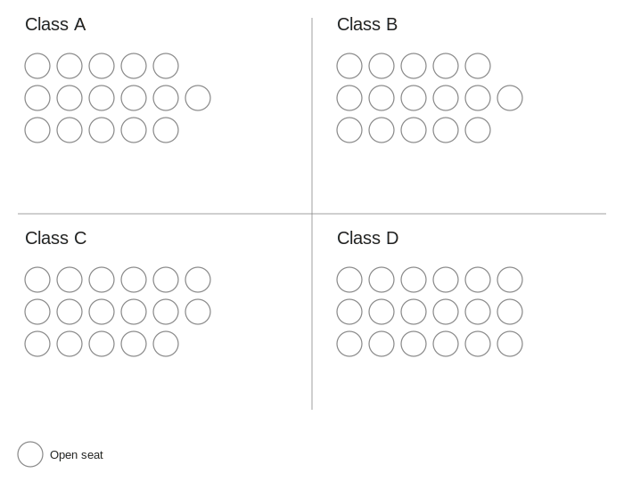

AES Preschool Structure: Why Four Classrooms?
==============================================

*A personal report by Scott Sauyet · scott@sauyet.com · Not an official town
document*

*Companion to the May 2, 2026 financial analysis · Visualizing AES Pre-K
enrollment from Dr. Valerie Bruneau's May 7, 2026 video update*

*Report compiled May 10, 2026, in response to discussion at the May 6, 2026
Andover Board of Finance meeting about whether the Andover Elementary School
preschool could be operated with two or three classrooms instead of four. The
report transcribes and recreates the diagrams Superintendent Dr. Valerie Bruneau
presented in her May 7, 2026 video response, then offers analytical observations
that connect the diagrams to the financial analysis published in the [companion
preschool funding
report](http://andoverct.info/reports/aes/preschool-funding/andover_ct_preschool_report.md).
The diagram counts and the dollar figures throughout this report are drawn
directly from the video; the analytical commentary and the connections to the
broader financial picture are this author's own.*

---

Overview
--------

At the Andover Board of Finance meeting on May 6, 2026, a member suggested that
the Andover Elementary School preschool could be reduced from four classrooms to
two or three as a cost-saving measure. The following day, Superintendent Dr.
Valerie Bruneau posted a video response (published to YouTube as
[youtube.com/watch?v=S39PhmDqDqg](https://www.youtube.com/watch?v=S39PhmDqDqg))
walking through the school's current enrollment using a sequence of simple
diagrams. The diagrams show, room by room, where students currently sit and how
each seat is funded — and they show, concretely, that a reduction to two or
three classrooms is not feasible with the program's current enrollment.

This report does three things:

1. Recreates the diagrams from the video at higher resolution, with cleaner
   typography and explicit legends, so they can be referenced and circulated.
2. Extracts the underlying enrollment counts — figures that the [companion
   financial
   report](http://andoverct.info/reports/aes/preschool-funding/andover_ct_preschool_report.md)
   identified as not-yet-publicly-available — and presents them in tabular form
   for the first time.
3. Connects the structural argument (why four classrooms is necessary) to the
   financial argument (whether the program is a net cost or net benefit to the
   town), drawing on both Dr. Bruneau's video and the financial report.

The video also corrects a misstatement Dr. Bruneau made at the May 6 meeting (the
minimum bus-eligibility age in Andover is 4, not 5), addresses a question about
how lunches and snacks are funded in the preschool, and confirms the final Board
of Finance budget result for the year. Those items are summarized in the final
section.

---

Part 1 — Why class creation matters
-----------------------------------

Before showing the diagrams, Dr. Bruneau spent the opening of her video explaining
what teachers and principals do every spring when they assign students to next
year's classrooms. The explanation is worth recapping because it's the framework
her diagrams sit inside.

In any K–6 school district that has more than one classroom per grade, "creating
classes" — deciding which students go in which room for the next school year —
is a deliberate spring process led by the principal and special education
director, in consultation with classroom teachers. The factors weighed include:

- **Special education needs.** Federal IDEA and Section 504 law require that
  students with IEPs and 504 plans be distributed across classrooms rather than
  concentrated in one. This is both an educational principle (least restrictive
  environment) and a staffing reality (one classroom can't reasonably support
  the support-staff ratio that an entire grade's worth of high-needs students
  would require).
- **Levels of academic performance.** Class creation tries to avoid classrooms
  where all the highest-achieving or all the most-struggling students in a given
  subject end up in the same room.
- **Personality and social fit.** Teachers know which students work well
  together, which combinations bring out the best, and — when parents have
  raised concerns — which combinations to avoid.
- **Gender balance.** Schools work to avoid lopsided classrooms (e.g., all girls
  in one room, all boys in another).
- **Racial and ethnic balance.** Many districts also actively balance classrooms
  by demographic background.

This is the framework that applies in every classroom and every grade. It
applies to the AES preschool too. The diagrams Dr. Bruneau presented show how the
preschool program's current four classrooms have been structured under these
constraints — and why consolidating them into fewer rooms is not a matter of
preference but of legal compliance and educational practice.

---

Part 2 — The diagrams from the video
------------------------------------

The five diagrams below are recreations of the whiteboards Dr. Bruneau presented
in her May 7, 2026 video, with cleaner typography and explicit legends. Each
diagram shows the four AES preschool classrooms as a 2×2 grid; each room
contains a grid of circles representing seats. Color encoding is consistent
across all five diagrams:

- **Blue** = Andover resident, general education
- **Pink** = Andover resident, high needs (IEP, 504, Birth-to-Three referral)
- **Green** = Out-of-town student paying tuition
- **White** (open circle) = Empty seat

Each diagram below corresponds to a specific moment in the video; timestamps
link to the relevant point.

### The base layout — empty rooms ([3:58](https://www.youtube.com/watch?v=S39PhmDqDqg&t=238s)) ###

The starting point: four rooms (A, B, C, D), each with a grid of seats. The seat
counts vary from room to room — Class A has 16 seats, Classes B and C have 17
each, and Class D has 18. The variation reflects the physical capacity of each
classroom space and the staffing ratio appropriate for that group.

### Andover residents only ([4:20](https://www.youtube.com/watch?v=S39PhmDqDqg&t=260s)) ###

Now Dr. Bruneau fills in the Andover-resident enrollment in blue. This single
diagram answers the structural question directly: there are 57 Andover residents
currently enrolled in the program, distributed across four classrooms. Three
classrooms with the program's typical 15-to-18-seat capacity could not contain
them.

Per-room breakdown:

| Class     | Andover residents | Open seats | Room capacity |
| --------- | ----------------: | ---------: | ------------: |
| A         | 15                | 1          | 16            |
| B         | 12                | 5          | 17            |
| C         | 16                | 1          | 17            |
| D         | 14                | 4          | 18            |
| **Total** | **57**            | **11**     | **68**        |

> **Notes:** Counts derived directly from the diagram Dr. Bruneau presented at the
> 4:20 mark of her May 7, 2026 video. The 57 Andover-resident figure is the
> single most important number in the structural argument: even consolidating
> into three rooms at 18 students per room (the upper end of the program's
> capacity) yields 54 seats — three short of current Andover demand alone.

The companion financial report observed in Part 5 that "the exact count of
out-of-town students enrolled in the program" was a figure not currently
published. The video's diagrams now make this and several related counts
publicly available, at least for this fiscal year.

### High-needs distribution ([4:40](https://www.youtube.com/watch?v=S39PhmDqDqg&t=280s)) ###

Dr. Bruneau next adds pink dots to mark the students with identified special needs
— those with IEPs, 504 plans, current Birth-to-Three referrals, or
consult-status referrals in process. There are nine such students currently
enrolled, distributed across all four rooms.

Per-room breakdown:

| Class     | High needs (pink) | Other Andover (blue) | Open   | Total  |
| --------- | ----------------: | -------------------: | -----: | -----: |
| A         | 2                 | 13                   | 1      | 16     |
| B         | 2                 | 10                   | 5      | 17     |
| C         | 3                 | 13                   | 1      | 17     |
| D         | 2                 | 12                   | 4      | 18     |
| **Total** | **9**             | **48**               | **11** | **68** |

> **Notes:** AES does not enroll out-of-town special-education students.
> Special-education services for non-resident children are the responsibility of
> the child's town of residence, not the host town. So all nine high-needs
> students shown here are Andover residents.

The distribution is the legally required pattern — every room has at least two
high-needs students. As Dr. Bruneau noted in the video, *"You don't put them in
one room. That is not educationally sound for students. It's not legal either."*
This is the federal Least Restrictive Environment requirement (34 CFR
§§300.114–300.120) operating in practice, and it is one structural reason the
program must run as four smaller classrooms rather than two or three larger
ones.

### Out-of-town tuition payers, with revenue overlay ([7:22](https://www.youtube.com/watch?v=S39PhmDqDqg&t=442s)) ###

Dr. Bruneau next adds green dots for the out-of-town students currently enrolled —
students who pay $6,000 per year in tuition and whose enrollment fills seats
that would otherwise sit empty. Yellow rectangles mark, room by room, the seats
that are already producing tuition revenue and the seats that could still be
filled by additional out-of-town students at $6,000 each.

Per-room breakdown:

| Class     | Pink | Blue | Green | Empty | Current tuition revenue | Potential if open seats fill |
| --------- | ---: | ---: | ----: | ----: | ----------------------: | ---------------------------: |
| A         | 2    | 13   | 0     | 1     | $0                      | $6,000                       |
| B         | 2    | 10   | 3     | 2     | $18,000                 | $30,000                      |
| C         | 3    | 13   | 1     | 1     | $6,000                  | $12,000                      |
| D         | 2    | 11   | 4     | 3     | $24,000                 | $42,000                      |
| **Total** | 9    | 47   | 8     | 7     | **$48,000**             | **$90,000**                  |

> **Notes:** Of the eight out-of-town students currently enrolled, two are
> children of AES staff members (per Dr. Bruneau's narration at
> [6:46](https://www.youtube.com/watch?v=S39PhmDqDqg&t=406s) — both are located
> in Class D). Staff children pay full tuition; the AEA and CSEA contracts do
> not contain a tuition-reduction provision for staff. The $6,000 figure is the
> published out-of-town tuition rate from the [2025–26 Preschool Registration
> Packet](https://www.andoverelementaryct.org/images/forms/prekregistration2526.pdf).

This diagram concretely illustrates a financial point made structurally in [Part
5 of the financial
report](http://andoverct.info/reports/aes/preschool-funding/andover_ct_preschool_report.md):
out-of-town enrollment is incremental revenue that helps fund the program. The
eight out-of-town students currently enrolled contribute approximately $48,000
in tuition revenue. If the seven remaining open seats in those rooms were also
filled with out-of-town students, the program would receive an additional
$42,000 — bringing total out-of-town tuition revenue to roughly $90,000 per
year.

That figure — approximately $90,000 in potential out-of-town tuition revenue —
is roughly the same magnitude as the program's net town subsidy on a
fully-loaded operating basis (estimated in Part 3 of the financial report at
approximately $92,000 per year, with a range of $84,000–103,000). Filling the
open seats with out-of-town tuition payers, where doing so is consistent with
the program's needs assessment, would substantially close the operating funding
gap.

### Next year's projection — 2026–27 ([9:31](https://www.youtube.com/watch?v=S39PhmDqDqg&t=571s)) ###

The final diagram is forward-looking. As of early May 2026, 46 Andover residents
have completed enrollment paperwork for the 2026–27 school year. Four
out-of-town families already enrolled this year have been invited back. Each
room is shown as a uniform 18-seat (3×6) grid — Dr. Bruneau notes that *"ideally
we always start at the 15 seats in a room until we know the needs of the
students,"* with capacity expanding to 18 if appropriate after needs assessment.

Per-room breakdown:

| Class     | Andover residents | Out-of-town returning | Open   | Total  |
| --------- | ----------------: | --------------------: | -----: | -----: |
| A         | 12                | 1                     | 5      | 18     |
| B         | 12                | 1                     | 5      | 18     |
| C         | 11                | 1                     | 6      | 18     |
| D         | 11                | 1                     | 6      | 18     |
| **Total** | **46**            | **4**                 | **22** | **72** |

> **Notes:** Pink/high-needs designations are not separately marked in this
> diagram because some of the special-education needs for incoming three-year-
> olds will not be confirmed until summer Birth-to-Three transfers and IEP
> meetings. Dr. Bruneau notes that the town's vital statistics show roughly 9–11
> additional Andover births from three years ago (the relevant cohort) whose
> families have not yet enrolled. Some will move in over the summer or register
> late; some may have moved out of town.

Twenty-two open seats remain. Several scenarios are possible:

- **If the 9–11 unaccounted Andover births enroll**, total Andover-resident
  enrollment would rise to roughly 55–57 — close to this year's level. Open
  seats would drop to about 11–13.
- **If incoming Birth-to-Three transfers add additional high-needs students**
  (the program typically learns of these in the May–July window), some open
  seats are reserved for those children regardless of out-of-town demand.
- **If after both groups are accommodated, open seats remain**, those seats can
  be filled by additional out-of-town tuition-paying students at $6,000 each.

Filling all 22 currently-open seats with out-of-town tuition payers is the
upper-bound scenario; doing so would generate $132,000 in additional tuition
revenue. The realistic figure is lower because some seats will go to incoming
Andover births and some to high-needs Birth-to-Three transfers — but the
direction is clear: the program has substantial unfilled capacity, all of which
is on offer for revenue contribution rather than cost.

---

Part 3 — Connecting the structural picture to the financial picture
-------------------------------------------------------------------

The diagrams above answer one question: can the program be run with fewer
classrooms? The answer is no, both because of the raw resident headcount (57
Andover residents this year, projected 46+ next year before unaccounted births
enroll) and because of the legal requirement to distribute high-needs students
across rooms. Two or three rooms would either turn away Andover residents or
violate the federal Least Restrictive Environment requirement — and likely both.

A separate question is what the program costs the town. That question was the
subject of the [May 2, 2026 financial
report](http://andoverct.info/reports/aes/preschool-funding/andover_ct_preschool_report.md)
and is summarized in this report's [Summary table](#summary-table). The short
version: the program is approximately revenue-neutral on the school's own
operating ledger and runs a small net town subsidy of approximately $92,000 per
year (range $84,000–103,000) on a fully-loaded basis that includes employee
benefits — and once the avoided special-education compliance cost is accounted
for (estimated at approximately $200,000 per year, range $170,000–230,000), the
program likely produces a net savings to the town of approximately $108,000 per
year.

The diagrams add three pieces of new information to that financial picture:

**The $90,000 of out-of-town tuition potential is a real lever.** The current
program collects approximately $48,000 in out-of-town tuition this year. The
diagrams show that the four-classroom structure has capacity for approximately
$90,000 of out-of-town tuition revenue per year if open seats are filled with
out-of-town tuition payers. That additional approximately $42,000 of potential
revenue — relative to the program's $84,000–103,000 net town subsidy — is
roughly half the gap. To the extent that filling open seats is consistent with
the program's needs assessment for each classroom, doing so directly reduces the
net town cost of the program.

**The 9 high-needs students are not hypothetical.** The financial report's Part
4 estimated the avoided special-education compliance cost at $170,000 to
$230,000 per year, based on national IDEA Section 619 identification rates of
6–7% applied to Andover's 75–90 student preschool-age cohort. The diagram in
this report shows nine specifically identified high-needs students currently
enrolled — at the high end of the 5–8 range Part 4 used as the working estimate.
If anything, the financial report's avoided-cost estimate is conservative.

**Out-of-town enrollment is structurally bounded by Andover demand.** With 57
Andover residents currently enrolled and only 8 out-of-town students, the
question of whether out-of-town enrollment "displaces" Andover residents is
answered by the diagram itself: it doesn't, because Andover residents fill 84%
of the program's seats and the remaining seats are either empty or filled by
tuition-paying non-residents. The published five-step priority order (detailed
in Part 5 of the financial report) ensures this in policy; the diagram makes it
visible in practice.

---

Part 4 — Two corrections and a confirmation from the video
----------------------------------------------------------

Dr. Bruneau used the same video to address two ancillary points raised at the May
6 Board of Finance meeting and to confirm the meeting's final budget outcome.
They are summarized here for completeness.

### Bus eligibility age: 4, not 5 ###

At the Board of Finance meeting Dr. Bruneau stated that the minimum age for bus
eligibility in Andover is 5. In the video she corrects this: in Andover the
minimum is **4**. (Eligibility ages vary by town across Connecticut.)

### Lunches and snacks: not paid from town general funds ###

A Board of Finance member asked at the May 6 meeting how lunches and snacks are
handled in the preschool. Dr. Bruneau's video clarifies:

- Children bring their own lunches.
- Andover children who qualify for free or reduced lunch receive it at no cost
  to the family; that cost is reimbursed federally and not borne by the town's
  general fund.
- Snacks and incidental food supplies for the preschool program (cups, napkins,
  plastic utensils, etc.) come from the preschool's supply line — the same line
  that funds the $36,000 in classroom expenditures and supplies shown at the
  bottom of the BOE's monthly financial report.

The video shows specific Coventry Food Service invoices for September and
October 2025 by way of confirmation. There is no separate "lunch budget" for the
preschool that draws on town general funds.

### Final Board of Finance budget action ###

The May 6 Board of Finance meeting concluded with the following budget
adjustments, which Dr. Bruneau summarized at the end of her video:

| Item                                                           | Amount                   |
| -------------------------------------------------------------- | -----------------------: |
| Reduction on the town side                                     | −$16,400                 |
| Governor's education aid (offsetting the school's ask)         | ~$100,000                |
| Capital account allocation diverted to current-year operations | −$50,000                 |
| Direct cut to school operating account                         | −$50,000                 |
| **Net effect on what voters will see at the next referendum**  | **~−$200,000 reduction** |

Dr. Bruneau noted that the $50,000 operating cut will be reconciled with the Board
of Education at a future meeting once the budget passes; if the cut cannot be
absorbed within current expenditures, it would be moved to the 2% non-lapsing
account, as was done with the previous year's $160,000 cut.

---

Summary table
-------------

| Question | Answer | Source |
| -------- | ------ | ------ |
| Can the AES preschool be run with two or three classrooms instead of four? | No. 57 Andover residents are currently enrolled — too many to fit even three rooms at the program's 18-seat upper capacity (54 seats). Federal LRE law also requires distributing the 9 identified high-needs students across rooms, not concentrating them. | Video diagrams [4:20](https://www.youtube.com/watch?v=S39PhmDqDqg&t=260s) and [4:40](https://www.youtube.com/watch?v=S39PhmDqDqg&t=280s) |
| How many students are in the program right now, broken down by category? | 57 Andover residents (9 high-needs, 48 general-ed) plus 8 out-of-town tuition payers (2 of whom are children of AES staff). 7 open seats remaining. Total enrollment 65 of 68 seats. | Video diagram [7:22](https://www.youtube.com/watch?v=S39PhmDqDqg&t=442s) |
| How much tuition revenue does the program currently collect from out-of-town families? | Approximately $48,000 per year (8 students × $6,000). | Diagram + published $6,000 tuition rate |
| How much additional tuition could be collected if remaining open seats were filled? | Approximately $42,000 per year (7 open seats × $6,000), bringing total out-of-town tuition to roughly $90,000. | Diagram + published $6,000 tuition rate |
| What is the relationship between this $42,000 of potential additional revenue and the program's net town cost? | The program's fully-loaded net town subsidy is estimated at approximately $92,000 per year (range $84,000–103,000); the additional $42,000 in potential out-of-town tuition would close roughly half that gap. | Combined with [Part 3 of financial report](http://andoverct.info/reports/aes/preschool-funding/andover_ct_preschool_report.md) |
| How many Andover residents are projected to enroll for 2026–27? | 46 confirmed as of early May 2026, with an estimated 9–11 additional unaccounted births from three years ago that may or may not enroll. Likely 2026–27 Andover enrollment: 50–57. | Video diagram [9:31](https://www.youtube.com/watch?v=S39PhmDqDqg&t=571s) |
| What is the minimum bus-eligibility age in Andover? | 4 years old. (Dr. Bruneau's previous statement of "5" was a misstatement, corrected in this video.) | Video [0:26](https://www.youtube.com/watch?v=S39PhmDqDqg&t=26s) |
| Are lunches paid from town general funds? | No. Children bring their own lunches; reduced-price meals are federally reimbursed; the program's incidental food supplies (snacks, napkins, utensils) come from the preschool's supply line within program revenue. | Video [10:41](https://www.youtube.com/watch?v=S39PhmDqDqg&t=641s) |

---

Key Observations
----------------

**The structural argument for four classrooms is conclusive on its own terms.**
Fifty-seven Andover residents are currently enrolled. Three rooms at 18 seats
each — the upper bound of the program's per-room capacity — total 54 seats. Even
before considering the legal requirement to distribute high-needs students
across rooms, three classrooms cannot contain current Andover demand. The
argument that the program could be reduced to two or three classrooms is not
consistent with the published enrollment numbers.

**The Least Restrictive Environment requirement is doing real work in this
classroom assignment.** The diagrams show pink dots (high-needs students)
distributed across all four rooms in a 2-2-3-2 pattern. This is not a
discretionary choice that could be rearranged for budget reasons; it is a
specific federal law (34 CFR §§300.114–300.120) that requires students with
disabilities to be educated alongside typically-developing peers to the maximum
extent appropriate. Concentrating these nine students into one or two rooms
would not save money — it would create a more restrictive, more expensive
setting that fails the LRE test and exposes the district to compliance
challenge.

**The current four-classroom structure is approximately right-sized for the
program's revenue model.** The program currently fills 65 of 68 seats — a 96%
utilization rate. Eight out-of-town students contribute approximately $48,000 in
tuition revenue; seven open seats represent another roughly $42,000 of
potential. This pattern — high resident demand, modest out-of-town participation
that fills incremental seats with incremental revenue, and small remaining
capacity — is what a financially well-tuned community preschool looks like.

**The diagrams answer questions Part 5 of the financial report flagged as
unavailable.** That report observed that "the exact count of out-of-town
students enrolled in the program," "the split between full-tuition and
sliding-scale out-of-town students," and "whether any of the out-of-town
students are children of Andover Public Schools employees" were figures not
currently published. The video diagrams confirm: 8 out-of-town students total
and 2 of them are staff children. The split between full-tuition and
sliding-scale out-of-town students is not separately shown in the diagrams, but
the residency restrictions on Smart Start (Andover residents only) plus the
8-student total bound the answer.

**The 9 high-needs figure validates the financial report's avoided-cost
estimate.** Part 4 of the financial report estimated the avoided
special-education compliance cost at approximately $200,000 per year, based on a
working assumption of 5–8 high-needs preschoolers per year. The diagrams show 9
— at or slightly above that range. The financial report's avoided-cost estimate
is, if anything, slightly conservative.

**Filling open seats with out-of-town tuition payers is fully consistent with
Andover-first enrollment policy.** The 7 currently-empty seats are not in demand
from Andover residents; if they were, they would already be filled under the
published five-step priority order (residents first at every income-eligibility
level). Filling these seats with out-of-town tuition payers — at $6,000 each,
contributing approximately $42,000 in additional revenue — does not displace any
Andover student. It converts unused capacity into program revenue.

**The program continues to perform as a working example of the Connecticut
preschool-funding model in a small town.** Andover residents fill 84% of the
program's enrolled seats. State Smart Start and Early Start grants pay for half
the certified teachers and one quarter of the paraeducators. Tuition from
full-pay families and from sliding-scale income-eligible families together cover
the remaining staff. Out-of-town tuition fills incremental seats with
incremental revenue. The program absorbs special-education mandate cost that
would otherwise fall as direct expenditure on the town. None of these elements
requires extraordinary effort to maintain; what is required is that they not be
undone in pursuit of an apparent saving that does not actually exist.

---

What this report does not show
------------------------------

A few caveats worth being explicit about:

This report does not establish what the appropriate number of preschool
classrooms would be at different levels of Andover demand. The current analysis
is specific to the 2025–26 enrollment of 57 Andover residents and the 2026–27
projected enrollment of 46+. If Andover demand were to fall substantially in
future years — for example, if the cohort sizes implied by recent town birth
records were to drop below 30 per year for a sustained period — the
four-classroom structure would warrant re-examination. That analysis would
require enrollment projections out beyond a single year and is not in the scope
of this report.

This report does not address the educational case for or against the preschool
program itself, or the question of whether the current program design (8 staff
serving up to 72 students, four classrooms, blended income eligibility) is the
best available program design for Andover. Those are important questions that
this report does not answer; the structural argument here is conditional on the
program existing in roughly its current form.

The recreation of the diagrams is faithful to the video but is not a verbatim
screenshot. Cell counts and color assignments were taken from the video at the
timestamps cited, but minor differences in the recreated layout versus the
original whiteboard sketches (for example, the exact column in which a
particular green dot is placed within a row) should be treated as illustrative
rather than authoritative. The summary counts per room — 15/12/16/14 Andover
residents, 9 total high-needs, 8 out-of-town, 7 empty — match the video.

The 2026–27 projection is exactly that — a projection. The 9–11 unaccounted
Andover births from three years ago may or may not enroll; some will move in
during the summer; some may opt to delay entry by a year; some may move out of
town. Birth-to-Three referrals received over the summer will fill some open
seats with high-needs incoming students. The realistic 2026–27 enrollment will
land somewhere in the middle of the scenarios sketched in Part 2, not at either
extreme.

The dollar figures attached to potential additional out-of-town tuition ($42,000
per year, $90,000 total potential) assume the published $6,000 out-of-town
tuition rate continues to apply. That rate is set by the BOE and could change.
Tuition increases would raise the figures proportionally; tuition decreases
would lower them.

This report does not capture every detail in Dr. Bruneau's video. Topics omitted
from this report include: the longer discussion of the rationale for the
class-creation process generally; her broader concern about misinformation in
town discussions; and her closing remarks about what budget decisions remain
ahead. Readers wanting the full picture should watch the video directly at the
YouTube link above.

---

Sources
-------

**Primary source for all diagram counts and dollar figures in this report:**

- **Dr. Valerie Bruneau, Superintendent of Andover Elementary School, May 7, 2026
  video update**, posted publicly to YouTube at
  [youtube.com/watch?v=S39PhmDqDqg](https://www.youtube.com/watch?v=S39PhmDqDqg).
  Specific timestamps cited inline above.

**Primary financial source for the connections to the broader cost picture:**

- **Andover Elementary School Preschool — Financial Analysis** (Sauyet, May 2,
  2026):
  [andoverct.info/reports/aes/preschool-funding/andover_ct_preschool_report.md](http://andoverct.info/reports/aes/preschool-funding/andover_ct_preschool_report.md).
  See particularly Part 3 (net financial impact), Part 4 (special-education
  counterbalancing effect), and Part 5 (out-of-town enrollment policy and
  financial flow).

**Underlying public sources cross-referenced in the analysis:**

- **Andover Elementary School 2025–26 Preschool Registration Packet**:
  [andoverelementaryct.org/.../prekregistration2526.pdf](https://www.andoverelementaryct.org/images/forms/prekregistration2526.pdf)
  — confirms the $6,000 out-of-town tuition rate and the five-step enrollment
  priority order.
- **Federal IDEA Part B Section 619** and the Least Restrictive Environment
  regulations at 34 CFR §§300.114–300.120 — the legal basis for distributing
  high-needs students across classrooms.
- **Andover Board of Finance meeting**, May 6, 2026 — the meeting that prompted
  Dr. Bruneau's video response. Public notice and agenda available through the
  town's [Boards &
  Commissions](https://andoverct.org/boards-commissions/board-of-finance) page.

---

Other Formats
-------------

This report is available in three formats, all located alongside this page:

| Format | File | Description |
|--|--|--|
| **Web (HTML)** | [`index.html`](./) | Interactive version with formatted tables and embedded diagrams; best for on-screen reading and sharing |
| **Markdown** | [`preschool_structure_report.md`](preschool_structure_report.md) | Plain-text version with diagram references; readable in any editor |
| **PDF** | [`preschool_structure_report.pdf`](preschool_structure_report.pdf) | Print-ready version with all tables and embedded diagrams |

The five SVG diagrams referenced throughout are also available as standalone
files in this folder for reuse: [`diagram-1-blank.svg`](diagram-1-blank.svg),
[`diagram-2-residents-only.svg`](diagram-2-residents-only.svg),
[`diagram-3-high-needs.svg`](diagram-3-high-needs.svg),
[`diagram-4-full-tuition.svg`](diagram-4-full-tuition.svg),
[`diagram-5-next-year.svg`](diagram-5-next-year.svg).
