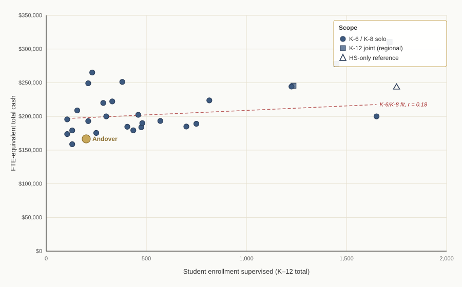

Superintendent Pay in Context
=============================

*Data covers essentially every Connecticut public school district that
operates only elementary grades (PK/K through 6 or 8) — 45 districts,
minus Norwich as structurally unlike. Contracts were assembled from town
and school-district websites, OCR of scanned PDFs, and direct §10-244c
records requests to town clerks where public postings did not surface a
current contract. Of the 44 working-set
peer districts, contract data is in hand for **40 districts across 30
unique peer superintendent contracts**, plus four reference contracts
(Amity Region 5, Northwestern Region 7, Chaplin/Region 11, and Union)
included on the contracts subpage but not ranked. For the remaining 4
peer districts a
thorough search of public sites and clerk outreach has not yet produced a
current contract. All figures are "cash compensation" — the salary line
plus any board-paid 403(b) annuity, longevity bonus, fixed transportation
allowance, and other lump sums. Health insurance value, life insurance
face amount, long-term disability, sick-day buyback, and IRS-rate mileage
reimbursements are excluded. Because Connecticut superintendent contracts
vary widely in work effort — from 12-hour-per-week part-time positions to
full-time K-12 regional superintendents — all dollar figures are
normalized to a hypothetical 1.0-FTE-equivalent (260-day work year) for
apples-to-apples comparison. Andover's portion of Dr. Bruneau's
compensation is reported separately so readers can see both what Andover
pays and what her market-rate compensation works out to.*

Overview
--------

**Andover pays its superintendent among the very lowest per-FTE rates
of any K-6/K-8-only elementary superintendent in the state.** In the
strict K-6/K-8 comparison — 2024-25 and 2025-26 contract vintages only,
24 peers — Andover is **23rd of 24**, at **$166,667** against a peer
median of $193,157 (roughly 16% above Andover). The only peer below is
Eastford, a 130-student district whose superintendent works 104 days
per year (0.40 FTE), at a derived FY 2025-26 rate of $158,695 — about
5% below Andover. The broader view (which also admits 2026-27
vintage-fallback entries) tells the same story: Andover 29th of 30,
Eastford last. Every other current K-6/K-8 peer contract pays
substantially more, and so do all the districts with more complex
shared-administration arrangements. *A caveat: we are still attempting
to collect current-vintage information on five additional peer
districts. Those could conceivably add another data point at or below
Andover's rate, but the general picture — Andover at the very bottom of
the peer distribution — is unlikely to change materially.*

Dr. Valerie Bruneau is Andover's Superintendent of Schools, and also
Scotland's, under a separate Scotland contract. She works 0.6 FTE for
Andover; her separate Scotland contract engages her at 0.4 FTE — each
fraction stated explicitly in its own contract. Andover's
contract pays her $90,000 cash plus a $10,000 mandatory 403(b) deferral
for the 2025–26 school year, an Andover-paid total of **$100,000**.
Scaling that 0.6-FTE pay to a full-time rate produces the implied
1.0-FTE-equivalent rate of $166,667 that the finding above rests
on.

The comparison spans every other Connecticut superintendent contract we
could locate for the 45 small towns identified as peers — towns of
similar size, similar grade-level structure, and similar regional
profile. Contracts came from public town-clerk pages, school-district
CMS crawls, direct §10-244c records requests to town clerks, and a
handful of user-supplied PDFs. Of 44 working-set peer towns (Norwich
excluded as structurally unlike), we have contract data on 39. The
report presents two different cuts of that data with different inclusion
rules; **Andover sits at the very bottom of both.**

One pattern from the analysis is worth flagging up front: **within the
K-6/K-8 cohort, FTE-equivalent pay is essentially uncorrelated with
district enrollment** (Pearson r ≈ 0.17 across 25 K-6/K-8 solo
contracts). Small Connecticut elementary districts pay their
superintendents in a fairly narrow band roughly independent of whether
the district has 100 students or 1,200 — the going rate is a market
price for the role, not a per-student rate. Andover's below-band
position therefore isn't explained by the district being smaller than
its peers.

A note on methodology before the numbers
-----------------------------------------

Two methodological choices shape every table that follows. Both deserve a line
of explanation before the numbers appear.

**FTE-equivalent, not raw salary.** Andover is a small K-6 district whose
part-time superintendent is also a part-time superintendent under a separate
contract with Scotland. Other towns in the peer set are small enough that they
share superintendents outright — Region 4 (Chester, Deep River, Essex/Centerbrook) has one K-12
superintendent across four boards; ER9 (Easton, Redding, Region 9) has one
across three. Comparing Andover's $100,000 Andover-paid amount to Region 4's
per-town share isn't apples-to-apples because Andover is paying for a 0.6-FTE
position while Region 4 districts are each paying for 25% of a different
person's time. The FTE-equivalent normalization expresses each contract as "what
would this superintendent earn if working a full 260-day work year at this
district's pay rate." It is the metric that makes contracts comparable across
different staffing arrangements.

**By contract, not by district.** When three boards sign one joint contract
(McKinnon for ER9; White for Region 4), it is one observation, not three. The
tables in this report dedupe by contract for joint cases (one row for McKinnon,
listing Easton/Redding; one for White, listing Centerbrook/Chester/Deep River).
Where the same person serves two districts under *separate* contracts, each
contract is counted as its own observation. Bruneau's Andover and Scotland contracts are
the canonical example: she appears under Andover (2025-26 contract) and again
under Scotland (2021-22, the latest Scotland contract located).

Part 1 — Dr. Bruneau's contract
-------------------------------

The current Andover contract runs from July 1, 2023 through June 30, 2026.
Section 2 explicitly defines the role as a 0.60 FTE position. Section 4 defines
"annual base salary" as the sum of (a) a cash component paid biweekly and (b) a
$10,000 mandatory deferral into a 403(b) annuity. The three contract-year
figures are:

### Andover's portion of Dr. Bruneau's compensation ###

| Contract year | Cash component | 403(b) deferral | Andover-paid total |
| ------------- | -------------- | --------------- | ------------------ |
| 2023–24       | $80,000        | $10,000         | $90,000            |
| 2024–25       | $85,000        | $10,000         | $95,000            |
| 2025–26       | $90,000        | $10,000         | $100,000           |

> **Notes:** Source: [Andover Superintendent Contract
> 2023-2026](https://www.andoverelementaryct.org/images/forms/2023-2026_Superintendents_Contract.pdf),
> Section 4 (BASE SALARY). The 403(b) amount is technically a "salary reduction
> agreement" — the Superintendent elects to defer $10,000 of her base salary
> into a tax-sheltered annuity — but it is part of the total compensation the
> Board is obligated to provide, and the Board reports the full $90K+$10K total
> to the Connecticut State Teachers' Retirement System.

**What "$166,667" includes.** The comparison tables in Part 3 sum, for every
contract, the same cash items: the salary cash component plus the board-paid or
board-provided 403(b) annuity plus any longevity bonus plus any fixed
transportation allowance. For Bruneau in 2025–26 that is $90,000 cash + $10,000
annuity = $100,000 — both lines included, not just the salary cash. Divided by
Andover's 0.6 FTE gives the 1.0-FTE-equivalent rate of $166,667 used in
every comparison below. Health insurance value, life insurance face amount,
long-term disability, sick-day buyback, and IRS-rate mileage reimbursements are
*not* included for any contract — see the Methodology italic at the top of the
report. The treatment is uniform: if a peer contract has its own annuity, it
is added in the same way.

The 2026–2029 successor contract — referenced in the FY26/FY27 town budget
approved February 11, 2026 — proposes a $100,000 cash component for FY 2026–27,
plus a $15,000 annuity (up from $10,000). Part 4 returns to that figure and
shows where it would land in the current peer distribution.

Part 2 — The peer cohort
------------------------

The original peer list contained 45 small Connecticut towns selected for
similarity to Andover (small enrollment, small budget, K-6 or K-8 elementary
structure, sometimes regional secondary). After excluding Norwich (which is
structurally very different — much larger, much more urban), the working
comparison set is 44 districts.

Of those 44, contract data is in hand for **32 unique superintendent
contracts covering 40 peer districts**. **30 of those contracts are
ranked in the tables below**; four are treated as reference observations
because the K-6/K-8 comparison isn't clean for them, and they appear on
the [contracts subpage](contracts/) but aren't ranked:

- **Amity Region 5** (Byars) — HS-only regional 7-12 supe shared by
  peer towns Bethany, Orange, and Woodbridge.
- **Northwestern Region 7** (LePage) — HS-only regional 7-12 supe shared
  by peer towns Barkhamsted, Colebrook, New Hartford, and Norfolk.
- **Chaplin / Region 11** (Skarzynski) — joint K-12 contract for Chaplin
  K-6 and Region 11 HS. Skarzynski also holds a separate 0.3-FTE Hampton
  contract, which makes the FTE denominator for the joint contract
  unreliable (treating it as 1.0 FTE would put his total at 1.3 FTE
  across all roles, which isn't physically plausible). Treating it as
  reference-only avoids a misleadingly low FTE-equivalent number in the
  ranking.
- **Union** (Jackopsic) — combined superintendent/principal position in
  a single ~45-student district (the smallest in Connecticut). The
  superintendent role is a $10,701 addendum to the principal contract
  with no stated hours split, so its FTE-equivalent rate is a modeled
  construct rather than a contract-stated figure (see the note below).

Only **4 peer districts remain pending**: Woodbridge (K-6 supe being
recruited), plus three very small EASTCONN-region districts where
part-time superintendent arrangements are common but the supe's name
and tenure are not always established with certainty (Ashford, North
Franklin, Pomfret Center).

CGS § 10-244c (Public Act 17-2) directs town clerks to post superintendent
contracts on the town website, but compliance is uneven. Requesting a copy
from the town clerk — including via the state's Freedom of Information
process — has turned out to be highly effective; almost every contract in
the dataset that wasn't publicly posted was obtained through a polite
records request to the town clerk.

The full list of pending districts appears in Sources at the end.

**A note on the Chaplin/Region 11 reference contract.** The Chaplin
shared-office arrangement is documented in a
[supporting research memo](research/chaplin-rd11/)
sourced to the Central Office Committee (COC) Budget 25-27. The COC
budget confirms the FY 2025-26 superintendent salary line is $141,750
and that the Chaplin/RD 11 allocation for the Superintendent's Office is
40/60 — meaning Chaplin bears $56,700 of that salary. Skarzynski also
holds a separate 0.3-FTE Hampton contract. Under the reasonable
assumption that no superintendent's contracted workload exceeds 1.0 FTE
in total, Chaplin/RD 11 accounts for at most 0.7 FTE of Skarzynski's
time, and Chaplin's 40% finance share of that maps to at most 0.28 FTE.
Chaplin's implied K-6 FTE-equivalent rate is therefore **at least
$202,500** — comfortably in the K-6/K-8 band and above Andover's
$166,667. Not precise enough to rank cleanly against solo K-6 contracts,
but not a case where Chaplin pays below Andover either. The supporting
memo carries the full set of qualifications for a reader who wants to
walk the underlying assumptions.

**A note on the Union reference contract.** Union — the smallest school
district in Connecticut (~45 students, one schoolhouse) — was resolved
by a records request to the town clerk, but with a twist: Union combines
the superintendent and elementary-principal roles in one person under
paired contracts. For 2025-26 the superintendent role is a $10,701
addendum (exactly one-twelfth of the $128,419 principal salary) with no
stated hours split, so there is no contract-stated superintendent salary
or FTE to rank. A
[supporting research memo](research/union-combined-position/)
reconstructs an FTE-equivalent rate by splitting the combined pay using
the market ratio of superintendent to elementary-principal pay in
Union's enrollment class (1.44, per the 2025-26 AASA salary study):
roughly **$217,000** FTE-equivalent on the memo's default accounting,
which counts the 10% board TSA contribution but excludes the contract's
cash-in-lieu-of-insurance stipend (matching the methodology's exclusion
of peers' health benefits; counting the stipend raises the figure to
about $231,000), with an implied superintendent time share of
about 5.5% — roughly 11–12 days a year. A peer-median benchmark and the
ratio method agree on the time split within about a percentage point.
The construct is consistent with the peer cohort's rates, but because it
is a modeled figure rather than contract-stated dollars, Union is
treated as reference-only rather than ranked.

Part 3 — Two views of the comparison
------------------------------------

The underlying data supports two views, each with a different inclusion
rule. Both use the same vintage-fallback policy — **2025-26 data where we
have it, 2024-25 if we don't, 2026-27 if that's all we have**. Older
"stale" data is excluded from these tables but the underlying PDFs remain
available in the [contracts](contracts/) subpage and in the
[spreadsheet](contracts.xlsx) for inspection.

### View 1 — All contracts we can find (current vintage) ###

The most inclusive ranked view. Includes every ranked contract whose data
passes the vintage-fallback rule, regardless of grade-level scope. One
contract — Byars Amity Region 5 — appears as an HS-only reference; two
— Lisbon (Keating) and Sterling (Friend) — have their own contract-shape
oddities flagged in the table notes.

Andover ranks **29th of 30** — second-lowest, just above Eastford.
Mean: $210,321. Median: $198,850.

| Rank   | Superintendent                | Year        | District(s)                                                          | FTE-equiv    |
| ------ | ----------------------------- | ----------- | -------------------------------------------------------------------- | -----------: |
| 1      | Dr. Jason McKinnon            | 2025–26     | Easton, Redding                                                      | $310,408     |
| 2      | Brian J. White                | 2025–26     | Centerbrook, Chester, Deep River                                     | $277,649     |
| 3      | Erika F. Sacharko             | 2025–26     | Barkhamsted                                                          | $265,141     |
| 4      | Sally A. Keating §            | 2026–27     | Lisbon                                                               | $251,210     |
| 5      | Dr. Patricia Cosentino        | 2025–26     | Sherman                                                              | $249,163     |
| 6      | Melony M. Brady-Shanley       | 2025–26     | Falls Village, Kent, Lakeville, North Canaan, Sharon, West Cornwall  | $245,610     |
| 7      | Dr. Vincent (Vince) Scarpetti | 2025–26     | Orange                                                               | $244,337     |
| 8      | Dr. Jennifer Byars †          | 2025–26     | Amity Region 5 (Bethany/Orange/Woodbridge)                           | $243,762     |
| 9      | Dr. Thomas Baird              | 2025–26     | Hebron                                                               | $223,736     |
| 10     | Dr. Holly B. Hageman          | 2025–26     | Marlborough                                                          | $222,222     |
| 11     | Theodore F. Friend §          | 2026–27     | Sterling                                                             | $219,860     |
| 12     | Immacolata Canelli            | 2024–25     | East Hartland                                                        | $208,880     |
| 13     | Barbara Wilson                | 2025–26     | Columbia                                                             | $202,400     |
| 14     | Scott Feder                   | 2025–26     | Voluntown                                                            | $200,000     |
| 15     | Dr. Candace Morell            | 2025–26     | Storrs (Mansfield)                                                   | $200,000     |
| 16     | Brian Hendrickson             | 2025–26     | Salem                                                                | $197,699     |
| 17     | Robert Gilbert                | 2025–26     | Colebrook                                                            | $195,620     |
| 18     | Jeffrey F. Sousa              | 2025–26     | New Hartford                                                         | $193,250     |
| 19     | Dr. Jack Zamary               | 2025–26     | Bozrah                                                               | $193,063     |
| 20     | Christopher Roche             | 2025–26     | Woodstock                                                            | $190,000     |
| 21     | Dr. Julie Luby                | 2025–26     | Winsted                                                              | $189,100     |
| 22     | Michele Raynor                | 2025–26     | Brooklyn                                                             | $185,000     |
| 23     | Kai Byrd                      | 2024–25     | Bethany                                                              | $184,642     |
| 24     | Dr. Christopher Bitgood       | 2025–26     | Canterbury                                                           | $183,801     |
| 25     | Dr. Roy Seitsinger            | 2025–26     | Preston                                                              | $179,307     |
| 26     | Andrew Skarzynski (Hampton)   | 2025–26     | Hampton                                                              | $179,167     |
| 27     | William Hull                  | 2025–26     | Baltic (Sprague)                                                     | $175,443     |
| 28     | Mary Beth Iacobelli           | 2024–25     | Norfolk                                                              | $173,750     |
| **29** | **Valerie Bruneau**           | **2025–26** | **Andover**                                                          | **$166,667** |
| **30** | **Dr. Donna P. Leake ‡**      | **2025–26** | **Eastford**                                                         | **$158,695** |

> **Notes:** † Byars's Amity Region 5 contract covers high-school-only
> (grades 7–12), a meaningfully different scope from the elementary-only
> superintendents that dominate this list — included as a reference
> observation representing 7-12 supervision paid by member towns through
> a regional district. § Lisbon and Sterling are entered under the
> vintage-fallback rule with 2026-27 contract data because no 2024-25 or
> 2025-26 data has been located for those districts. Their figures are
> the earliest year of a future-effective contract and may be re-papered
> upward by the time those years arrive. ‡ Eastford's FY 2025-26 figure
> is *derived*, not directly cited in a document on hand. The June 19,
> 2026 annual amendment letter to Dr. Leake's 2021 base contract states
> a 3.0% raise bringing FY 2026-27 salary to $65,382.01 for 104 days;
> backing out that raise gives an FY 2025-26 salary of $65,382.01 /
> 1.03 = $63,478 (rounded), which at the same 104-day work year works
> out to an FTE-equivalent of $158,695. The June 2025 amendment letter,
> which would confirm FY 2025-26 directly, is not on hand. Skarzynski
> also serves Hampton K-8 under a separate part-time contract (rank 26
> above); his separate Chaplin+Region 11 joint K-12 contract is treated
> as a reference (see Part 2 introduction) rather than ranked, because
> the joint contract's FTE denominator is entangled with the Hampton
> contract in a way we can't cleanly resolve. The Steven LePage Region 7
> (2023-2026) contract is excluded under the vintage-fallback rule
> because we have year-1 data only and the rule requires 2024-25 or
> newer — the PDF remains on the contracts subpage for reference.

### View 2 — K-6 / K-8 only, current contracts only (strict) ###

The most apples-to-apples view: K-6/K-8 scope, contract data from 2024–25
or 2025-26 (no future-fallback). This eliminates uncertainty about
whether older contracts have been renegotiated since and removes the
joint-K-12 and HS-only outliers.

Andover ranks **23rd of 24** — second-lowest, just above Eastford.
Mean: $198,379. Median: $193,157. Andover is **−14% below the median**.

| Rank   | Superintendent                | Year        | District(s)         | FTE-equiv    |
| ------ | ----------------------------- | ----------- | ------------------- | -----------: |
| 1      | Erika F. Sacharko             | 2025–26     | Barkhamsted         | $265,141     |
| 2      | Dr. Patricia Cosentino        | 2025–26     | Sherman             | $249,163     |
| 3      | Dr. Vincent (Vince) Scarpetti | 2025–26     | Orange              | $244,337     |
| 4      | Dr. Thomas Baird              | 2025–26     | Hebron              | $223,736     |
| 5      | Dr. Holly B. Hageman          | 2025–26     | Marlborough         | $222,222     |
| 6      | Immacolata Canelli            | 2024–25     | East Hartland       | $208,880     |
| 7      | Barbara Wilson                | 2025–26     | Columbia            | $202,400     |
| 8      | Scott Feder                   | 2025–26     | Voluntown           | $200,000     |
| 9      | Dr. Candace Morell            | 2025–26     | Storrs (Mansfield)  | $200,000     |
| 10     | Brian Hendrickson             | 2025–26     | Salem               | $197,699     |
| 11     | Robert Gilbert                | 2025–26     | Colebrook           | $195,620     |
| 12     | Jeffrey F. Sousa              | 2025–26     | New Hartford        | $193,250     |
| 13     | Dr. Jack Zamary               | 2025–26     | Bozrah              | $193,063     |
| 14     | Christopher Roche             | 2025–26     | Woodstock           | $190,000     |
| 15     | Dr. Julie Luby                | 2025–26     | Winsted             | $189,100     |
| 16     | Michele Raynor                | 2025–26     | Brooklyn            | $185,000     |
| 17     | Kai Byrd                      | 2024–25     | Bethany             | $184,642     |
| 18     | Dr. Christopher Bitgood       | 2025–26     | Canterbury          | $183,801     |
| 19     | Dr. Roy Seitsinger            | 2025–26     | Preston             | $179,307     |
| 20     | Andrew Skarzynski (Hampton)   | 2025–26     | Hampton             | $179,167     |
| 21     | William Hull                  | 2025–26     | Baltic (Sprague)    | $175,443     |
| 22     | Mary Beth Iacobelli           | 2024–25     | Norfolk             | $173,750     |
| **23** | **Valerie Bruneau**           | **2025–26** | **Andover**         | **$166,667** |
| **24** | **Dr. Donna P. Leake ‡**      | **2025–26** | **Eastford**        | **$158,695** |

> **Notes:** Filter: `--scope k-6,k-8` (the strict rule). **Only
> Eastford pays a lower per-FTE rate than Andover**, and by about
> $8,000 (~5%). ‡ Eastford's FY 2025-26 figure is *derived*, not
> directly cited: the June 19, 2026 amendment letter states a 3.0%
> raise bringing FY 2026-27 salary to $65,382.01 for 104 days; backing
> out that raise gives $63,478 for FY 2025-26, which at the same 104-day
> work year is $158,695 per FTE. The June 2025 amendment letter (which
> would confirm this figure directly) is not on hand. If the derivation
> is set aside, Andover remains rank 23 of 23 — last with no peer below.
> The next-lowest peer *above* Andover in either treatment is Norfolk at
> $173,750, 4% above. Scotland is not in this table because the Scotland
> contract on file is stale (2021–22, Bruneau year-1 figure); a current
> Scotland contract has not been located, and there's no basis for
> assuming what rate it would land at — the two districts negotiate
> independently. The median is $193,157 (15.9% above Andover); the mean
> is $198,379 (19.0% above Andover).

Pay vs district size
--------------------

The two views above rank districts by FTE-equivalent pay only. This
scatter overlays that pay figure against the total student enrollment the
superintendent supervises, which is one of the plainer proxies for the
job's scale.

> **Notes:** Enrollment counts are the K–12 student totals under the
> superintendent's supervision for the 2024–25 school year (CT EdSight
> October-1 counts). For solo K-6/K-8 contracts, that's the district's
> elementary enrollment. For joint K-12 regional contracts (McKinnon ER9,
> White Region 4, Brady-Shanley Region 1), the count is the sum across
> all member districts' K-8 populations plus the regional HS. For the two
> HS-only reference contracts (LePage Region 7, Byars Amity Region 5),
> only the regional HS enrollment is shown. Andover's point is
> highlighted; among K-6/K-8 peers with similar enrollment, only
> Eastford pays a lower per-FTE rate. Enrollment values are cross-checked against
> published district budgets where available; where only approximate
> counts were available they are flagged in `enrollment.json` in the
> working repository.

Summary table
-------------

| Question                                                            | Answer                                                                                          |
| ------------------------------------------------------------------- | ----------------------------------------------------------------------------------------------- |
| What does Andover pay Dr. Bruneau for FY 2025–26?                   | $90,000 cash + $10,000 403(b) = **$100,000** total                                              |
| What's the 1.0-FTE-equivalent rate that implies?                    | **$166,667** (Andover engages her at 0.6 FTE — 60% of a full-time workload)                                   |
| Where does that rank against peer Connecticut superintendents?      | Second-lowest in both views: 23rd of 24 in the strict K-6/K-8 view, 29th of 30 in the broad view — only Eastford below |
| How far below the K-6/K-8 peer median is Andover?                   | $26,490 (−14%) below the strict K-6/K-8 median of $193,157; $32,183 (−16%) below the broad-view median of $198,850 |
| Does any K-6/K-8 peer pay less than Andover?                        | **Only Eastford** — a 130-student district with a 104-day/year part-time supe, at a derived FY 2025-26 rate of $158,695 (~5% below Andover). Derivation backs out the 3.0% raise stated in the June 19, 2026 amendment letter. |
| What is "cash compensation" in this report?                         | Base salary + board-contributed 403(b) + longevity bonuses + fixed transportation allowances    |
| What's excluded?                                                    | Health insurance value, life insurance face amount, LTD, IRS-rate mileage, sick-day buyback     |

Key Observations
----------------

**Andover's superintendent rate sits at the very bottom of the peer
distribution across every cut of the data.** The finding is not an
artifact of one inclusion rule. In the strict view (K-6/K-8 only,
2024-25 or 2025-26 vintages — N=24) Andover is 23rd of 24, with only
Eastford below. In the broad view (every ranked contract with current
data, all scopes — N=30) Andover is 29th of 30, again with only
Eastford below.

**The strict K-6/K-8 view is the cleanest comparison.** It eliminates two
confounders — scope mismatch (K-12 regional supes earn more because their
role is bigger) and stale data (older contracts almost certainly have
step-ups not visible from the dollar figures we have). In that view,
Andover is rank 23 of 24 — second-lowest, with Eastford (‡ derived
FY 2025-26 figure) $8,000 (~5%) below at $158,695. The next-lowest peer
*above* Andover is Norfolk at $173,750, 4% above; the median is
$193,157, roughly 16% above.

**Eastford's FY 2025-26 rate is derived, not directly cited.** The
June 19, 2026 amendment letter to Dr. Leake's contract states a 3.0%
raise bringing FY 2026-27 salary to $65,382.01 for 104 days. Backing
out that raise gives $63,478 for FY 2025-26 — $158,695 per FTE at the
same 104-day work year. The June 2025 amendment letter (which would
confirm the figure directly) is not on hand; obtaining it would replace
the derivation with a source-primary citation. If the derivation is
set aside entirely, Eastford falls out of the strict view and Andover
returns to 23 of 23 last — but the broader picture, that Eastford and
Andover sit together at the very bottom of the K-6/K-8 distribution,
is unaffected.

**Stale and reference-only contracts don't appear in the ranking tables.**
The underlying older PDFs (Stevens West Willington 2023–24, Bruneau
Scotland 2021–22, LePage Region 7 2023–24) and the four reference
contracts (Amity Region 5, Region 7, Skarzynski Chaplin+Region 11,
Jackopsic Union) remain on the [contracts subpage](contracts/) and in the
[downloadable spreadsheet](contracts.xlsx) for inspection.

**Enrollment doesn't explain the gap.** Within the K-6/K-8 cohort, pay
and enrollment are essentially uncorrelated (Pearson r ≈ 0.17, r² ≈ 0.03
— roughly 3% of the pay variance is "explained" by district size). Small
CT elementary districts pay their superintendents in a fairly narrow band
of $175K–$220K per FTE regardless of whether they have 100 students or
1,200, which the scatter plot in "Pay vs district size" above makes
visible. Andover and Eastford both sit below that band. The apparent
upward trend in the full-cohort scatter comes from the K-12 regional
joint contracts (McKinnon ER9, White Region 4, Brady-Shanley Region 1)
at the top-right, not from the K-6/K-8 cohort where Andover competes.

**Only 4 peer districts remain pending.** Records requests to town clerks
under CGS §10-244c have resolved essentially every contract that could be
resolved that way. The remaining four — Ashford, North Franklin
(Franklin), Pomfret Center, Woodbridge — are the smallest of the
EASTCONN-area districts plus Woodbridge, which is between supes. The
missing rates could land above or below Andover's; whether they do is
genuinely unknown.

What this report does not show
------------------------------

- **Total compensation** including health insurance value, life insurance
  face amount, long-term disability, sick-day buyback, and IRS-rate mileage.
  These items vary widely across districts and a fair comparison would
  require valuing each district's specific health plan; the cash-only
  comparison sidesteps that. This matters because superintendents
  negotiate their own preference balance between cash and benefits, and
  some low-cash contracts likely reflect a supe-side preference for a
  benefits-heavy package rather than a below-market total. A cash-only
  ranking cannot distinguish between the two.
- **Years of experience or tenure.** A first-year superintendent at $200,000 is
  a different observation from a 20-year veteran at $200,000. This report treats
  every contract uniformly regardless of the superintendent's experience.
- **Cost of living adjustments.** Fairfield County districts (Easton, Redding)
  have higher local costs than the eastern Connecticut towns that dominate the
  lower end of this distribution. The FTE-equivalent figures are nominal, not
  cost-of-living-adjusted.
- **Per-pupil or per-budget normalization.** A larger district legitimately
  needs a more senior superintendent, and some peers manage two or three times
  Andover's enrollment. This report normalizes by FTE, not by enrollment or
  budget size.
- **The missing peers.** The 4 districts where clerk outreach has not yet
  produced a current contract may have rates above or below the current
  cohort.
- **A causal claim about appropriateness.** This report describes where Andover
  sits in the peer distribution. It does not argue that being below median is
  good or bad, or that any particular pay rate is the "right" one. That is a
  judgment for residents.

Sources
-------

### Bulk downloads ###

- **[All contracts as a zipped archive](contracts.zip)** — every PDF
  referenced below, organized by district slug, with a manifest CSV.
- **[Contracts subpage](contracts/)** — sortable table linking directly to
  each contract PDF; stale and future-dated entries included with flags
  for inspection.

*(The component-level spreadsheet that complements these sources is in the
[Other Formats](#other-formats) section below.)*

### Andover-specific documents ###

- **Andover Superintendent Contract 2023-2026** —
  [andoverelementaryct.org/.../2023-2026_Superintendents_Contract.pdf](https://www.andoverelementaryct.org/images/forms/2023-2026_Superintendents_Contract.pdf)
  (scanned PDF, OCR'd)
- **Andover FY26/FY27 Town Budget** — approved at the February 11, 2026 Town
  Meeting; provides FY27 proposed figures

### Pending — contract not located in public search (4) ###

Four peer districts remain pending. Woodbridge is in transition (K-6 supe
being recruited); the other three are very small EASTCONN-region districts
where part-time supe arrangements are common and the supe's name and
tenure aren't always established with certainty: Ashford, North Franklin
(Franklin), Pomfret Center.

All 30 peer-district contracts in the analysis plus the four reference
contracts (Amity Region 5, Northwestern Region 7, Chaplin/Region 11,
Union) are listed with links on the
**[Contracts subpage](contracts/)** and included in the
[downloadable ZIP](contracts.zip) and [spreadsheet](contracts.xlsx).

### Excluded ###

Norwich (too dissimilar in size and structure to be a useful peer).

### Statutory basis ###

- CT Public Act 17-2 § 157 / CGS § 10-244c (requirement to post superintendent
  contracts on town websites)

### Methodology and tooling ###

Contracts were collected by scanning town and school-district websites,
running OCR on scanned PDFs, and extracting the relevant sections of each
contract into a common structured format capturing cash components (base
salary, board-paid 403(b), longevity, fixed transportation allowance,
professional dues, other lump sums), work-year FTE fraction, contract
term, and joint-signatories where applicable. Where public postings did
not surface a current contract, the relevant town clerk was emailed a
§10-244c records request; nearly every remaining contract in the dataset
was obtained that way. The `compensation.json` data file linked from the
[contracts subpage](contracts/) and the
[spreadsheet](contracts.xlsx) is the authoritative structured form of
what was extracted from each contract PDF.

Other Formats
-------------
