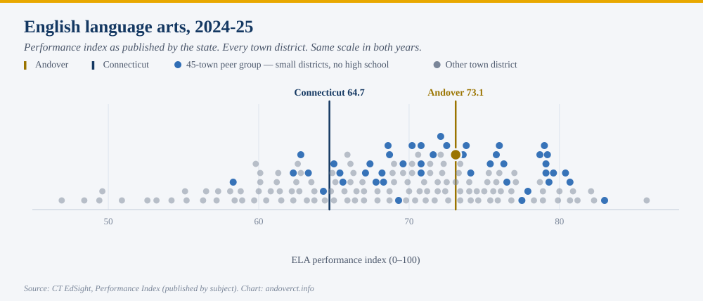
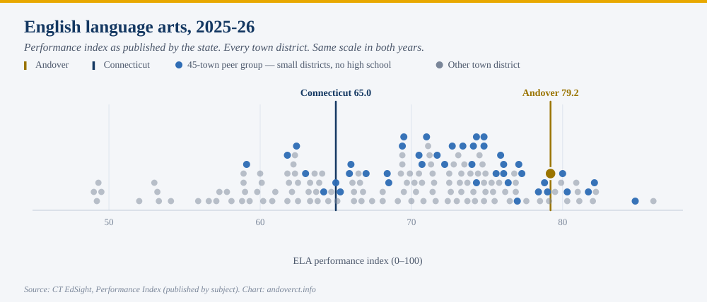
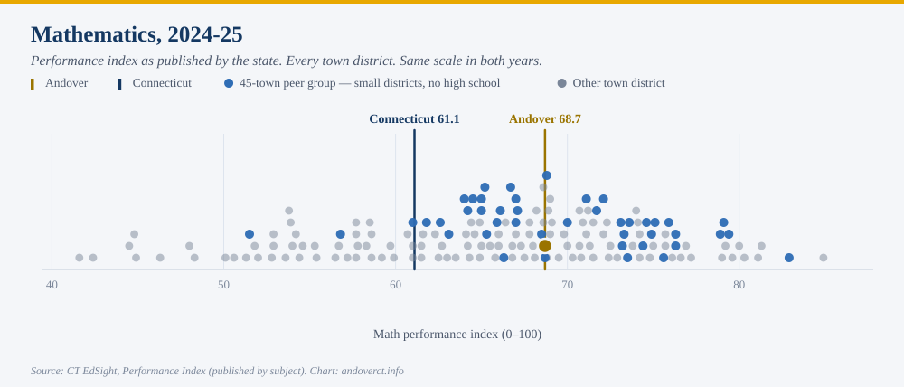
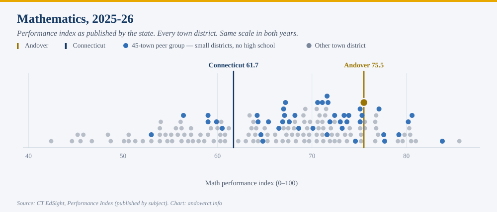
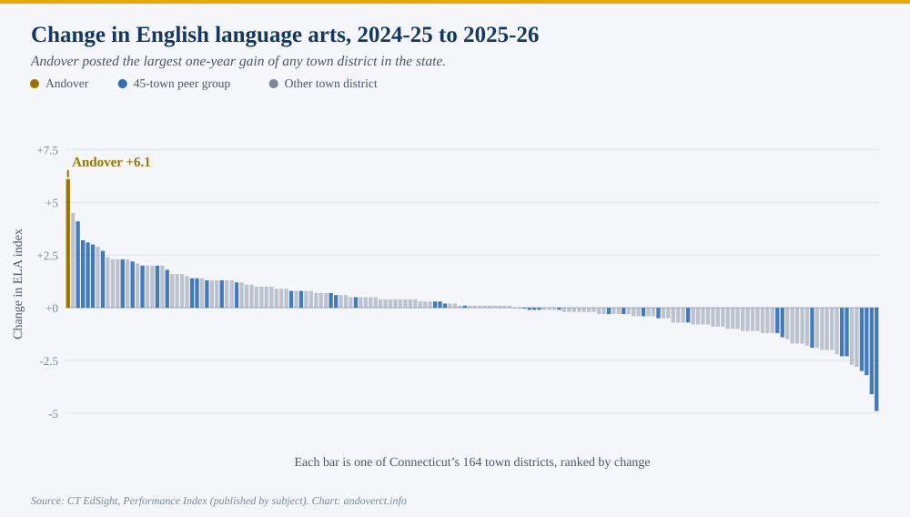
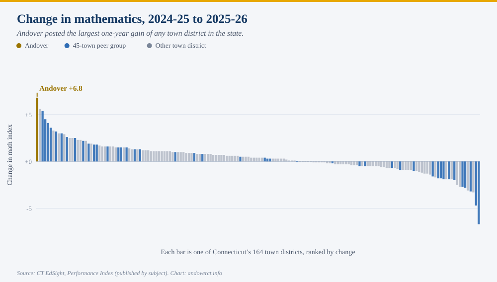

The Rivereast News Bulletin reported the results on September 18, under the headline
"Andover Elementary Celebrates Increase in Test Scores." The article followed Principal
Taylor Parker's presentation to the Board of Education on September 9, and she did not
undersell it:

> I'm so excited. Thank you for letting me share in celebrations, because we
> definitely have a lot to celebrate.
>
> *— Taylor Parker, AES principal, Board of Education meeting, Sept. 9, 2026*

Every figure in that article checks out. We compared each one against the state's own
published data &mdash; the proficiency rates, the growth figures, the statewide
averages and the index scores &mdash; and they match. What follows is not a
correction. It is the context a single school's announcement is not in a position to
supply: where those numbers put Andover among Connecticut's 164 town districts, which
of them carry the most weight, and which should be held lightly.

The underlying numbers are public, and they are worth setting out in full, because
a result this good invites two opposite mistakes. One is to wave it away as noise
or as a demographic accident. The other is to treat a single year as proof of
something permanent. Neither is right, and the data is detailed enough to say so
precisely.

Everything below comes from the Connecticut State Department of Education's public
EdSight system, released in late August. Every figure is also published here as a
spreadsheet &mdash; [the full workbook](andover-edsight-data.xlsx) carries the
district-by-district data behind this page, and names the sheet each figure can be
checked against. (The 2025-26 growth figures below were published after it was last
built, and will be added on its next refresh.)

What the state publishes
------------------------

*Connecticut scores every district on a 0-100 performance index, separately for
each subject. Andover's rose 6.1 points in English and 6.8 in math.*

The performance index is the state's summary of how students did on the annual
assessments &mdash; Smarter Balanced in English and math, the NGSS science test &mdash;
placed on a common 0-100 scale so districts can be compared. The state publishes it
**subject by subject**; it does not publish a single combined figure. Connecticut's
stated target is 75 in each subject. A year ago Andover was below it in both
English and math. It is now above it in both.

Each pair is drawn on one scale, so the movement between years is directly
comparable. Across the state, the English index went from 64.7 to 65.0 and the math
index from 61.1 to 61.7.

- **+6.1** — Andover's one-year change in English language arts, from 73.1 to 79.2
- **+6.8** — Andover's one-year change in mathematics, from 68.7 to 75.5
- **1st of 164** — where each of those gains ranks among town districts
- **+0.1 and +0.4** — the median change across town districts, English and math

Neither is a close call. In English, the next largest gain was 4.5 points; in math,
5.6. Six districts gained three points or more in English and ten in math. Just over
half of all districts improved at all: 55 percent in English, 59 percent in math.

Among the state's town districts, Andover moved from tied for 55th to 15th in
English, and from tied for 67th to 23rd in math.

In Andover's own record, neither subject has moved this far in a single year. The
previous largest one-year gain was 3.8 points in English, between 2021-22 and
2022-23, and 1.1 points in math.

It is worth being exact about one thing the charts do not say. These are Andover's
**largest one-year gains**, and its best results **since 2018-19** &mdash; but not
its best ever. Andover scored 81.0 in English and 76.5 in math in 2018-19, before
the pandemic. What 2025-26 represents is most of the way back to where Andover was
before COVID.

The third subject, and the combined figure
------------------------------------------

*Science fell. How you combine the three subjects changes the ranking, so here it is
every way.*

- **&minus;3.3** — science, from 76.5 to 73.2, now just below the state's target of 75

Science is tested only in grades 5, 8 and 11, so in Andover it rests on roughly two
dozen students in a single grade &mdash; small enough that a few children moving a
band or two will swing it several points. It is the least stable of the three
figures in either direction, and it should not carry much weight on its own. It is
included here because leaving it out would be the kind of selective reporting this
series exists to correct.

Because EdSight does not publish a single figure across subjects, any combined number
is a choice someone has made. The one used in the rest of this page is ours: the
three subject indices **weighted by the number of students who sat each test**. That
keeps science, which only three grades take, from counting as a full third of the
result. By that measure Andover rose from 71.5 to 76.9, also the largest gain in the
state.

Weight the three subjects equally instead, and the answer changes. Andover's
combined gain becomes 3.2 points, and it ranks **sixth** among the 156 districts
reporting all three &mdash; because the one subject that fell is given the same
weight as the two that rose. That is a legitimate way to look at it, and it is why
the headline claim on this page rests on the subjects themselves: first in the
state in English, and first in the state in math.

The test that usually explains these things away
------------------------------------------------

*District test scores mostly measure which students a district serves. Andover's
gain survives that adjustment.*

This is the single most important thing to understand about school test data, and
it is the reason a result like Andover's deserves scrutiny before celebration.

Across Connecticut, the strongest predictor of a district's results is not its
spending, its size, or its leadership. It is the share of its students who are
classified as high needs &mdash; eligible for free or reduced-price meals, an English
learner, or a student with a disability. On the combined index, that one variable
explains about three quarters of the difference between districts.

The relationship is almost exactly as strong in the new year as the old one:
r&nbsp;=&nbsp;&minus;0.873 in 2024-25, &minus;0.878 in 2025-26. Every ten
percentage points of additional high-needs enrollment is associated with roughly
four and a half fewer index points.

So the fair question is not "did Andover's score go up" but "did it go up by more
than the change in its students would predict." Andover's high-needs share did
fall, from 38.3 percent to 35.8 percent. That accounts for part of the gain &mdash;
but only part.

- **+5.5** — Andover's raw gain on the combined index
- **+4.1** — the gain that remains after adjusting for the change in student need
- **+1.0 &rarr; +5.1** — Andover's position relative to what its demographics predict

Measured against the statewide pattern, Andover went from performing about as
expected to performing five points better than expected &mdash; the district's
strongest showing on that measure since 2018-19.

On the combined index, Andover's rank among the state's town districts moved from
61st of 165 to 22nd of 164. Within its own comparison group of small districts
without a high school, from 22nd of 45 to 9th of 44.

What one year can and cannot tell you
-------------------------------------

*About a hundred students sit these tests. That cuts both ways.*

Andover Elementary tested 109 students in 2025-26. In a district that size, each
child is worth roughly a full percentage point of any subgroup figure, and
year-to-year results are genuinely volatile: on the combined index, districts testing
fewer than 200 students swing about two and a half times as much from year to year
as districts testing 600 or more.

That volatility is exactly why Andover's result is notable rather than routine
&mdash; its gains are the largest in the state in both English and math, including
against the small districts where large swings are most common. But it is also why
a single year should not be read as a trend. The honest statement is that Andover
has had an excellent year, on top of a long record of performing at or above what
its demographics predict, and that one more year of data will say much more than
this one does.

The fairer measure, and what is still to come
---------------------------------------------

*Growth is the measure that best isolates what a school contributes. On it, Andover's
year is more remarkable than the headline suggests.*

The performance index measures where students are. It does not measure how far
they moved, and because it tracks so closely with student need, it is a limited
tool for judging a school's own contribution.

Connecticut publishes a better measure: academic growth, which matches each
individual student to their own prior-year score and asks what share of their
personal growth target they achieved. It is far less determined by demographics
&mdash; student need explains about a quarter of the variation in growth, against
three quarters for the combined index &mdash; which makes it the fairer measure of a
district's work.

Connecticut reports growth two ways. The **growth rate** is the share of students who
met their target &mdash; the figures Parker gave the board. The **average percentage of
target achieved** counts partial progress too, and it is the version the state uses in
its accountability system. On that second measure:

- **85.0** — Andover, 2025-26, averaged across English and math
- **60.1** — Connecticut, 2025-26
- **69.5 and 61.4** — the same two figures a year earlier

Andover went from eight points above the state to twenty-five, while the state itself
edged down.

This is arguably the more impressive half of Andover's year, and it is the half least
explained by who its students are.

One caution on timing. These growth figures are published now, with the assessment
results. What arrives around November is the **Next Generation Accountability**
release, which packages growth as one indicator among twelve and adds the rest:
chronic absenteeism, physical fitness, and, for districts that have them, graduation
and college-and-career measures. That is the release this page will return to.

The rest of the picture, 2024-25
--------------------------------

*The six charts below are the full comparison set for the most recent year in
which every measure exists.*

Two of them repeat measures from above, at that year, so the set can be read on its
own. Where a chart shows performance across all three subjects, it uses the combined
index described above.

Two things stand out in that set, and both are worth stating plainly because they
cut against arguments made in every direction locally.

The first is that per-pupil spending barely relates to results at all. Across the
state's town districts, spending explains something like seven percent of the
difference in the combined index and eight percent in growth &mdash; and once
student need and grade span are accounted for, no statistically detectable amount.
That is not evidence that money does not matter. It is evidence that what varies
between Connecticut towns is mostly district size and geography, not educational
effort, and that test scores cannot settle a budget argument in either direction.

The second is that growth tracks student need far less closely than the combined
index does. That is the case for paying attention to the November release rather
than this one.

What the school said, and what the numbers add
----------------------------------------------

*The article's figures are accurate. Three of its themes are worth extending.*

**On growth.** Parker drew the distinction that matters most in this data, and drew
it correctly:

> Every student gets a target, whether you score a one or a four. So even students
> performing above grade level have a target score.
>
> *— Taylor Parker, Board of Education meeting, Sept. 9, 2026*

That is exactly why growth is the fairer measure. Achievement scores largely track
which students a district serves; growth asks how far each student moved from their
own starting point, and is far less determined by demographics. The figures she gave
the board &mdash; 68.7 percent of students meeting their ELA target, 67.5 percent in
math, against 44.4 and 41.1 a year earlier &mdash; are the state's published growth
rates, and they are correct.

**On the achievement gap.** The article reports that the gap between high-needs
students and their classmates narrowed in both subjects, from 20.7 points to 14.5.

> We want all students growing.
>
> *— Taylor Parker, Board of Education meeting, Sept. 9, 2026*

This is the one figure on which we can offer no independent check. Andover's
high-needs subgroup is small enough that the state suppresses its results publicly
to protect student confidentiality, so the underlying numbers are not in EdSight.
The claim comes from the district's own data, and should be read as such &mdash; not
because there is reason to doubt it, but because it cannot be verified the way
everything else here can.

**On not over-reading one year.** The article closes on a note of caution that this
page would make anyway, and it is to the school's credit that it came from the
school:

> It is not a one-shot deal. We can't just say we had one good year.
>
> *— Taylor Parker, Board of Education meeting, Sept. 9, 2026*

About 110 students sit these tests. That is small enough that a strong cohort moves
the whole district figure, in either direction. The case for taking this year
seriously is not the size of the jump on its own; it is that the jump survives
adjustment for student need, that it holds in both subjects independently, and that
it sits on a decade in which Andover has almost always performed at or above what
its demographics predict.

Sources
-------

- **The underlying data.** [Download the workbook](andover-edsight-data.xlsx)
  (Excel). It opens on a documented cover page explaining each EdSight dataset used,
  what the measures mean and how they are defined, who is included, and the cautions
  that go with them. A "key figures" sheet lists every number cited on this page
  against the sheet it can be verified on, except the 2025-26 growth figures, which the
  state published after the workbook was last built. The rest is the data itself: every town
  district in 2024-25 and 2025-26 by subject, the year-over-year change by subject,
  ten years of the performance index, nine of academic growth, spending by function,
  and the peer group.
- **Connecticut State Department of Education, EdSight.** All figures are from the
  public EdSight system: the **Performance Index** report (school, district and
  state indices by subject and student group), **Next Generation Accountability**
  (academic growth, indicator 2), and **Per Pupil Expenditures by Function
  (District)**. Performance index results are released in late August each year;
  accountability results around the following November.
- **Coverage.** Comparisons cover Connecticut's 165 local and regional town
  districts (164 in 2025-26). Charter districts, the regional educational service
  centers, the technical high school system and state-agency schools are excluded
  throughout: they serve different populations under different rules, and the
  service centers in particular sit at the top of every per-pupil spending
  ranking.
- **Performance index.** EdSight publishes the index separately for English
  language arts, mathematics and science; the English and math figures on this page
  are exactly as published. The **combined index** is this page's own calculation:
  the three subject indices weighted by the number of students who sat each, so
  science &mdash; tested only in grades 5, 8 and 11 &mdash; is not given a third of
  the weight. Weighted equally instead, Andover's 2025-26 combined gain is 3.2
  points and ranks sixth of 156, rather than 5.5 points and first; both versions are
  in the workbook.
- **Academic growth.** The average share of each student's individual growth target
  achieved, English and mathematics, grades 4 through 8, matched to that student's
  own prior-year score. Not the share of students meeting their target, which
  Connecticut reports separately and does not use for accountability.
- **High needs.** Eligible for free or reduced-price meals, an English learner, or
  a student with a disability. The Connecticut figure shown on the charts is the
  statewide student share, which sits well to the right of most towns because
  high-need students are concentrated in the cities.
- **Peer group.** The same 45-district set used in this site's earlier report on
  peer spending: districts that run only elementary grades and send older students
  elsewhere for high school. Norwich meets that structural test but was excluded
  from the analysis there, for the reasons set out in that report &mdash; it is a
  city district several times the size of any other member. It is excluded here on
  the same basis. Norwich appears in that report's published comparison data, so
  readers who want to include it can.
- **Spending.** Reported by districts to the state and not fully audited; the
  state notes that audits may change the figures. Excludes debt, capital beyond
  equipment, adult education, community services, non-local food service and state
  teacher retirement contributions, so it will not match a town's appropriated
  school budget.
