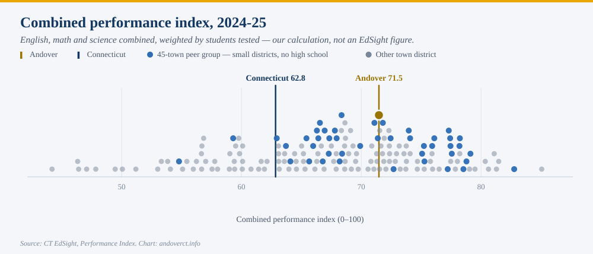
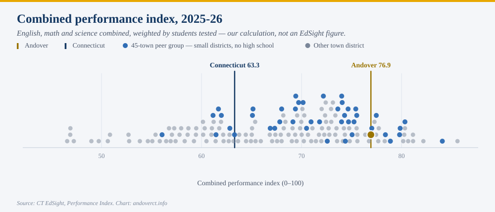
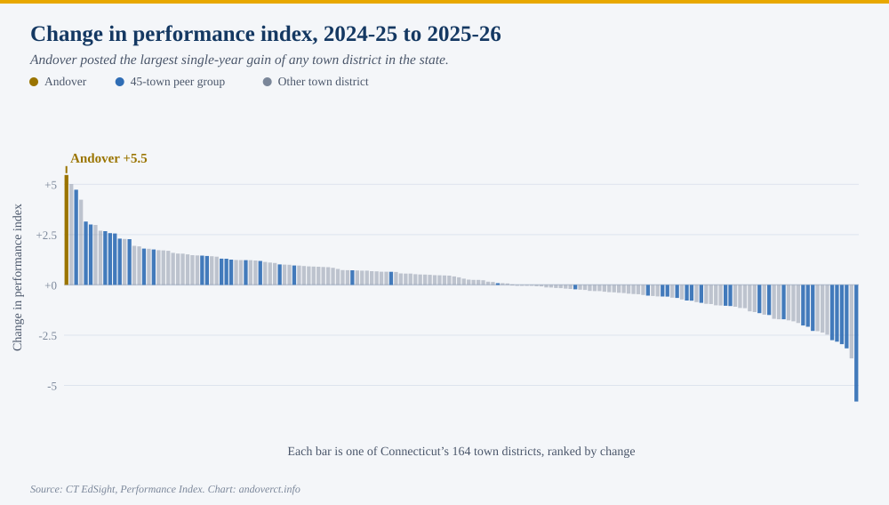
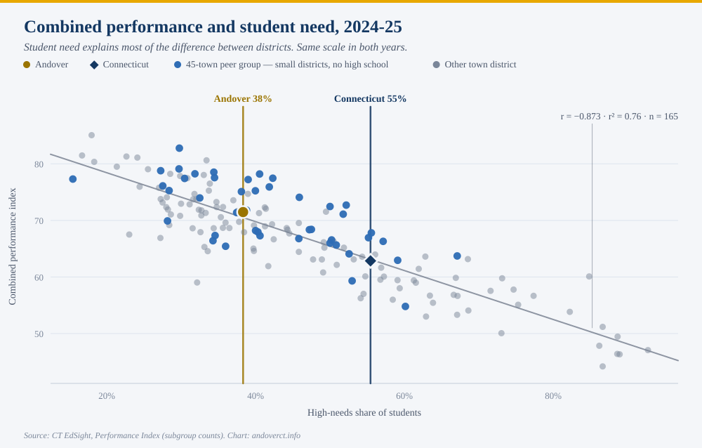
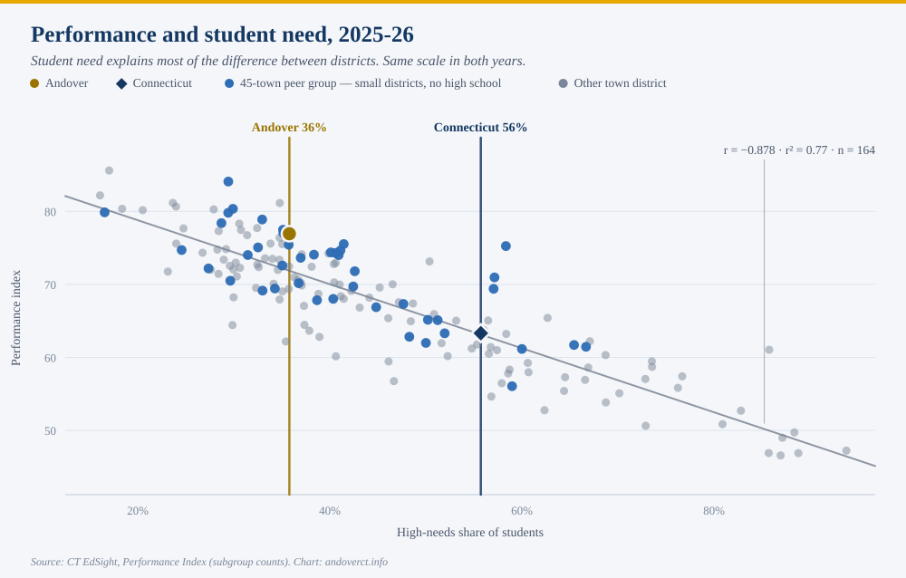
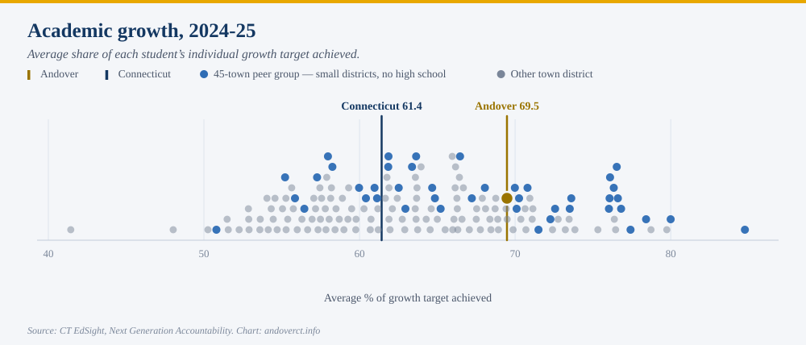
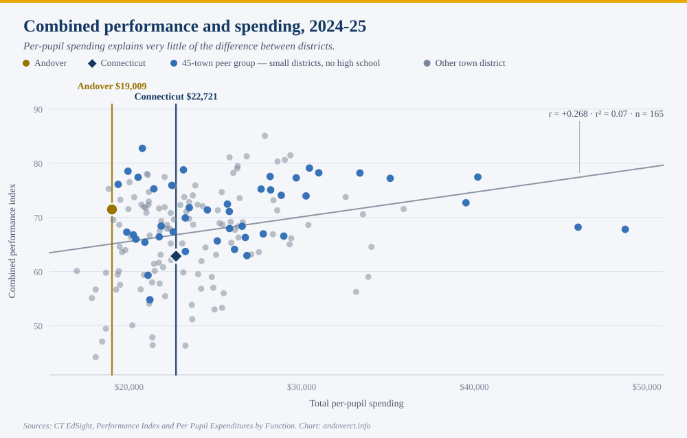
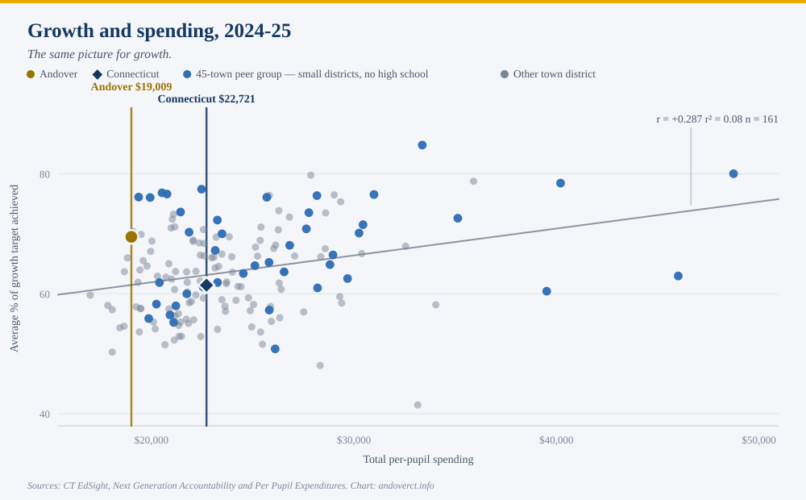
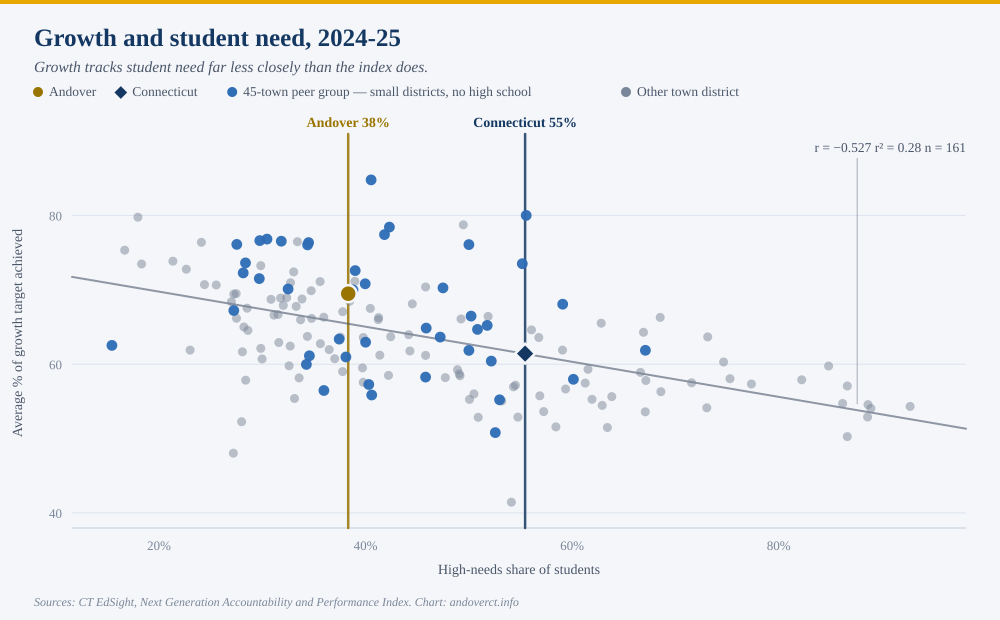

[PLACEHOLDER: opening paragraph keyed to the newspaper article — its headline,
its framing, and what it did or did not include. Written once the article runs.]

The underlying numbers are public, and they are worth setting out in full, because
a result this good invites two opposite mistakes. One is to wave it away as noise
or as a demographic accident. The other is to treat a single year as proof of
something permanent. Neither is right, and the data is detailed enough to say so
precisely.

Everything below comes from the Connecticut State Department of Education's public
EdSight system, released in late August. Every figure is also published here as a
spreadsheet &mdash; [the full workbook](andover-edsight-data.xlsx) carries each
number cited on this page, the sheet it can be checked against, and the
district-by-district data underneath it.

What the number is
------------------

*Connecticut scores every district on a 0-100 performance index. Andover's rose
from 71.5 to 76.9.*

The performance index is the state's summary of how students did on the annual
assessments &mdash; Smarter Balanced in English and math, the NGSS science test &mdash;
placed on a common 0-100 scale so districts can be compared. Connecticut's stated
target for every district is 75. Andover is now above it.

Both charts are drawn on the same scale, so the movement is directly comparable.
The state as a whole went from 62.8 to 63.3. Andover went from 71.5 to 76.9.

- **+5.5** &mdash; Andover's one-year change in the performance index
- **+0.35** &mdash; the median change across Connecticut's 164 town districts
- **+0.5** &mdash; the statewide change
- **1st of 164** &mdash; where Andover's gain ranks among town districts

Andover's move is the largest of any town district in the state, and it is not a
close call: only six districts gained three points or more, and the next largest
gain was 5.0. Fifty-seven percent of districts improved at all.

In Andover's own eleven-year record, no single year has moved this far. The
previous best was a three-point gain between 2016-17 and 2017-18.

It is worth being exact about one thing the chart does not say. This is Andover's
**largest one-year gain**, and its best result **since 2018-19** &mdash; but not its
best ever. The district scored 78.8 in 2018-19, before the pandemic. What 2025-26
represents is a return to, and nearly all the way back to, where Andover was
before COVID.

Where the gain came from
------------------------

*English and math both rose sharply. Science fell.*

The index combines three subjects, weighted by how many students sat each test.
Breaking it apart:

- **+6.1** &mdash; English language arts, from 73.1 to 79.2
- **+6.8** &mdash; mathematics, from 68.7 to 75.5
- **&minus;3.3** &mdash; science, from 76.5 to 73.2

The English and math gains are large and they are what drove the overall number.
Science moved the other way. Science is tested only in grades 5, 8 and 11, so in
Andover it rests on roughly two dozen students in a single grade &mdash; small
enough that a few children moving a band or two will swing it several points. It
is the least stable of the three figures in either direction, and it should not
carry much weight on its own. It is included here because leaving it out would be
the kind of selective reporting this series exists to correct.

The test that usually explains these things away
------------------------------------------------

*District test scores mostly measure which students a district serves. Andover's
gain survives that adjustment.*

This is the single most important thing to understand about school test data, and
it is the reason a result like Andover's deserves scrutiny before celebration.

Across Connecticut, the strongest predictor of a district's performance index is
not its spending, its size, or its leadership. It is the share of its students who
are classified as high needs &mdash; eligible for free or reduced-price meals, an
English learner, or a student with a disability. That one variable explains about
three quarters of the difference between districts.

The relationship is almost exactly as strong in the new year as the old one:
r&nbsp;=&nbsp;&minus;0.873 in 2024-25, &minus;0.878 in 2025-26. Every ten
percentage points of additional high-needs enrollment is associated with roughly
four and a half fewer index points.

So the fair question is not "did Andover's score go up" but "did it go up by more
than the change in its students would predict." Andover's high-needs share did
fall, from 38.3 percent to 35.8 percent. That accounts for part of the gain &mdash;
but only part.

- **+5.5** &mdash; Andover's raw gain
- **+4.1** &mdash; the gain that remains after adjusting for the change in student need
- **+1.0 &rarr; +5.1** &mdash; Andover's position relative to what its demographics predict

Measured against the statewide pattern, Andover went from performing about as
expected to performing five points better than expected &mdash; the district's
strongest showing on that measure since 2018-19.

Andover's raw rank among the state's town districts moved from 61st of 165 to
22nd of 164. Within its own comparison group of small districts without a high
school, from 22nd of 45 to 9th of 44.

What one year can and cannot tell you
-------------------------------------

*About a hundred students sit these tests. That cuts both ways.*

Andover Elementary tested 109 students in 2025-26. In a district that size, each
child is worth roughly a full percentage point of any subgroup figure, and
year-to-year results are genuinely volatile: among Connecticut districts testing
fewer than 200 students, the typical year-over-year swing is two and a half times
that of districts testing 600 or more.

That volatility is exactly why Andover's result is notable rather than routine
&mdash; a +5.5 is the largest gain even among the small districts, where large
swings are most common. But it is also why a single year should not be read as a
trend. The honest statement is that Andover has had an excellent year, on top of a
long record of performing at or above what its demographics predict, and that one
more year of data will say much more than this one does.

What is still to come
---------------------

*The measure that best isolates what a school contributes is not published yet.*

The performance index measures where students are. It does not measure how far
they moved, and because it tracks so closely with student need, it is a limited
tool for judging a school's own contribution.

Connecticut publishes a better measure: academic growth, which matches each
individual student to their own prior-year score and asks what share of their
personal growth target they achieved. It is far less determined by demographics
&mdash; student need explains about a quarter of the variation in growth, against
three quarters for the index &mdash; which makes it the fairer measure of a
district's work.

That data, part of the Next Generation Accountability release, is published around
November for the preceding school year. **The 2025-26 growth figures are not
available yet.** When they arrive, this page will be followed by a fuller
accounting.

On the most recent growth data that does exist, for 2024-25, Andover scored 69.5
against a state figure of 61.4.

The rest of the picture, 2024-25
--------------------------------

*The six charts below are the full comparison set for the most recent year in
which every measure exists.*

Two of them repeat charts from above, at that year, so the set can be read on its
own.

Two things stand out in that set, and both are worth stating plainly because they
cut against arguments made in every direction locally.

The first is that per-pupil spending barely relates to results at all. Across the
state's town districts, spending explains something like seven percent of the
difference in the performance index and eight percent in growth &mdash; and once
student need and grade span are accounted for, no statistically detectable amount.
That is not evidence that money does not matter. It is evidence that what varies
between Connecticut towns is mostly district size and geography, not educational
effort, and that test scores cannot settle a budget argument in either direction.

The second is that growth tracks student need far less closely than the index
does. That is the case for paying attention to the November release rather than
this one.

[PLACEHOLDER: a section responding to specific claims, quotes or framings from the
newspaper article and any public reaction to it. Left open deliberately; the
factual groundwork above stands on its own.]

Sources
-------

- **The underlying data.** [Download the workbook](andover-edsight-data.xlsx)
  (Excel, twelve sheets). It opens on a documented cover page explaining each
  EdSight dataset used, what the measures mean and how they are defined, who is
  included, and the cautions that go with them. A "key figures" sheet lists every
  number cited on this page against the sheet it can be verified on. The rest is
  the data itself: every town district in 2024-25 and 2025-26, the year-over-year
  change, ten years of the performance index, nine of academic growth, spending by
  function, and the peer group.
- **Connecticut State Department of Education, EdSight.** All figures are from the
  public EdSight system: the **Performance Index** report (school, district and
  state indices by subject and student group), **Next Generation Accountability**
  (academic growth, indicator 2), and **Per Pupil Expenditures by Function
  (District)**. Performance index results are released in late August each year;
  accountability results around the following November.
- **Coverage.** Comparisons cover Connecticut's 165 local and regional town
  districts (164 in 2025-26). Charter districts, the regional educational service
  centers, the technical high school system and state-agency schools are excluded
  throughout: they serve different populations under different rules, and the
  service centers in particular sit at the top of every per-pupil spending
  ranking.
- **Performance index.** Combined across English, mathematics and science weighted
  by the number of students who sat each subject, so science &mdash; tested only in
  grades 5, 8 and 11 &mdash; is not given a third of the weight.
- **Academic growth.** The average share of each student's individual growth target
  achieved, English and mathematics, grades 4 through 8, matched to that student's
  own prior-year score. Not the share of students meeting their target, which
  Connecticut reports separately and does not use for accountability.
- **High needs.** Eligible for free or reduced-price meals, an English learner, or
  a student with a disability. The Connecticut figure shown on the charts is the
  statewide student share, which sits well to the right of most towns because
  high-need students are concentrated in the cities.
- **Peer group.** The same 45-district set used in this site's earlier report on
  peer spending: districts that run only elementary grades and send older students
  elsewhere for high school. Norwich meets that structural test but was excluded
  from the analysis there, for the reasons set out in that report &mdash; it is a
  city district several times the size of any other member. It is excluded here on
  the same basis. Norwich appears in that report's published comparison data, so
  readers who want to include it can.
- **Spending.** Reported by districts to the state and not fully audited; the
  state notes that audits may change the figures. Excludes debt, capital beyond
  equipment, adult education, community services, non-local food service and state
  teacher retirement contributions, so it will not match a town's appropriated
  school budget.
